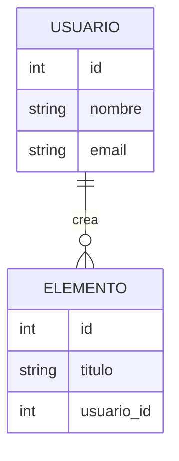

# Contrato Técnico — [Nombre del proyecto]

| Campo | Valor |
|---|---|
| Equipo / Autor(es) | |
| Versión | 0.1 |
| Fecha | AAAA-MM-DD |
| Documento de origen | [01-vision-y-alcance.md](./01-vision-y-alcance.md) |
| Estado | Borrador / En revisión / Aprobado |

> **Propósito de este documento:** la Etapa 1 explicó *qué* problema resolvemos y *por qué*. Este contrato define *cómo se verificará* que la solución funciona y *qué decisiones técnicas* se tomaron. Es el documento que se le entrega a quien construye (persona o IA).
>
> **Regla de oro:** no repitas aquí los requisitos de la Etapa 1. Refiérete a ellos por su ID (RF-01, RNF-02...) y agrega solo lo que falta para poder construir y probar.

---

## 1. Contexto

*Un párrafo (máx. 5 líneas): qué es el sistema, para quién y qué problema resuelve, en tus propias palabras. Termina con el enlace a la Etapa 1.*

**Alcance del MVP:** lista los IDs de los RF que entran al MVP y los que quedan para después.

| ID | Requisito (título corto) | Prioridad | ¿Entra al MVP? |
|---|---|---|---|
| RF-01 | | Debe | Sí |
| RF-02 | | Debería | Sí |
| RF-03 | | Podría | No |

> Prioridad: **Debe** (sin esto el MVP no sirve), **Debería** (importante, pero hay alternativa), **Podría** (deseable).

---

## 2. Decisiones de arquitectura

Registra cada decisión importante con esta estructura (una por bloque). Mínimo 3.

### ADR-01 — [Título de la decisión]

- **Contexto:** ¿qué problema o restricción obliga a decidir?
- **Opciones consideradas:** A, B, C.
- **Decisión:** ¿cuál elegiste?
- **Justificación:** ¿por qué esta y no las otras?
- **Consecuencias:** ¿qué ganas y qué pierdes?

*Temas sugeridos para tus ADR:*

- Stack (frontend, backend, base de datos).
- Enfoque de UI: **mobile-first** y responsividad.
- **API-first:** ¿la lógica vive en una API reutilizable por una futura app móvil (Etapa 6)?
- Autenticación y manejo de sesiones.
- Persistencia y almacenamiento local (si aplica).
- Despliegue y entorno de pruebas.

---

## 3. Modelo de datos e interfaces

### 3.1 Modelo de datos

*Entidades principales, sus atributos clave y relaciones. Puede ser una tabla, un diagrama Mermaid o ambos.*

### 3.2 Contratos de interfaz (API o pantallas)

*Para cada endpoint o pantalla principal: qué recibe, qué devuelve y qué errores puede dar.*

| Método y ruta | Descripción | Entrada | Salida exitosa | Errores |
|---|---|---|---|---|
| `POST /api/...` | | `{ ... }` | `201 { ... }` | `400`, `401` |
| `GET /api/...` | | | `200 [ ... ]` | `404` |

---

## 4. Criterios de aceptación

Un bloque por cada RF **del MVP**. Cada criterio usa el formato Given/When/Then y debe poder responderse con "pasa" o "no pasa".

Incluye siempre: el **camino feliz**, al menos **un caso de error** y al menos **un caso límite** (vacío, duplicado, dato muy largo, sin conexión, etc.).

### RF-01 — [Título del requisito]

**CA-01.1 (camino feliz)**
- **Given** un usuario que no tiene cuenta
- **When** completa el formulario de registro con correo y contraseña válidos
- **Then** el sistema crea la cuenta y lo redirige a la pantalla de inicio

**CA-01.2 (error)**
- **Given** un usuario que ya tiene una cuenta con ese correo
- **When** intenta registrarse con el mismo correo
- **Then** el sistema muestra el mensaje "Este correo ya está registrado" y no crea una cuenta nueva

**CA-01.3 (caso límite)**
- **Given** un usuario en un teléfono con pantalla de 360 px de ancho
- **When** abre el formulario de registro
- **Then** todos los campos y el botón son visibles y utilizables sin desplazamiento horizontal

### RF-02 — [Título del requisito]

**CA-02.1 (camino feliz)**
- **Given** ...
- **When** ...
- **Then** ...

*(Repite para cada RF del MVP.)*

---

## 5. Requisitos no funcionales verificables

Convierte cada RNF de la Etapa 1 en algo **medible**. Evita palabras como "rápido" o "seguro" sin un número o una prueba concreta.

| ID | Categoría | Criterio medible | Cómo se verifica |
|---|---|---|---|
| RNF-01 | Rendimiento | La pantalla principal carga en menos de 3 s con conexión 4G simulada | Lighthouse / DevTools |
| RNF-02 | Usabilidad | Los elementos táctiles miden al menos 44×44 px | Revisión manual |
| RNF-03 | Seguridad | Las contraseñas se almacenan con hash, nunca en texto plano | Revisión de código |

---

## 6. Fuera de alcance técnico

*Qué decisiones o funcionalidades técnicas **no** se harán en este MVP (para evitar que la IA o el equipo las agreguen por iniciativa propia).*

- No se implementará ...
- No se soportará ...

---

## 7. Supuestos y preguntas abiertas

| # | Supuesto o pregunta | Responsable | Estado |
|---|---|---|---|
| 1 | | | Abierta |

---

## 8. Contexto para el asistente de IA

*Bloque que se pega al inicio de cada sesión con la IA (Claude, Gemini, Copilot, etc.) para que genere código coherente con este contrato.*

- **Stack:** ...
- **Estructura del proyecto:** ...
- **Convenciones:** (nombres, estilo de código, idioma de mensajes)
- **Reglas:** no agregar funcionalidades fuera de los criterios de la sección 4; no cambiar decisiones de la sección 2 sin proponerlo primero; toda funcionalidad nueva debe tener un criterio de aceptación asociado.

---

## 9. Uso de IA en esta entrega

*Sección obligatoria. Documenta de forma honesta y específica cómo usaron agentes de IA para elaborar **este contrato** (no el sistema). No basta con "usamos ChatGPT para todo".*

| Agente / modelo | Sección del contrato | Para qué se usó | Qué tuvimos que corregir manualmente |
|---|---|---|---|
| | | | |
| | | | |

**Ejemplos de correcciones manuales útiles de reportar:** criterios genéricos que no correspondían a nuestro proyecto, funcionalidades inventadas que no estaban en la Etapa 1, decisiones de arquitectura sin justificación real, endpoints incompletos o inconsistentes con el modelo de datos.

**Reflexión breve (3 a 5 líneas):** ¿qué fue lo que la IA hizo bien, qué hizo mal y qué haríamos distinto la próxima vez?

---

## 10. Lista de verificación antes de entregar

- [ ] Todos los RF del MVP tienen al menos 3 criterios (feliz, error, límite).
- [ ] Cada criterio se puede verificar con "pasa / no pasa".
- [ ] No hay requisitos copiados de la Etapa 1; solo se referencian por ID.
- [ ] Hay al menos 3 decisiones de arquitectura justificadas.
- [ ] Los RNF tienen una métrica y una forma de verificación.
- [ ] La sección 6 (fuera de alcance) no está vacía.
- [ ] El bloque para el asistente de IA (sección 8) está completo.
- [ ] La sección 9 (uso de IA) indica agente, para qué se usó y qué se corrigió a mano.
- [ ] Cada integrante del equipo puede explicar y defender el documento completo.

---

## Historial de cambios

| Versión | Fecha | Cambio | Autor |
|---|---|---|---|
| 0.1 | | Versión inicial | |
