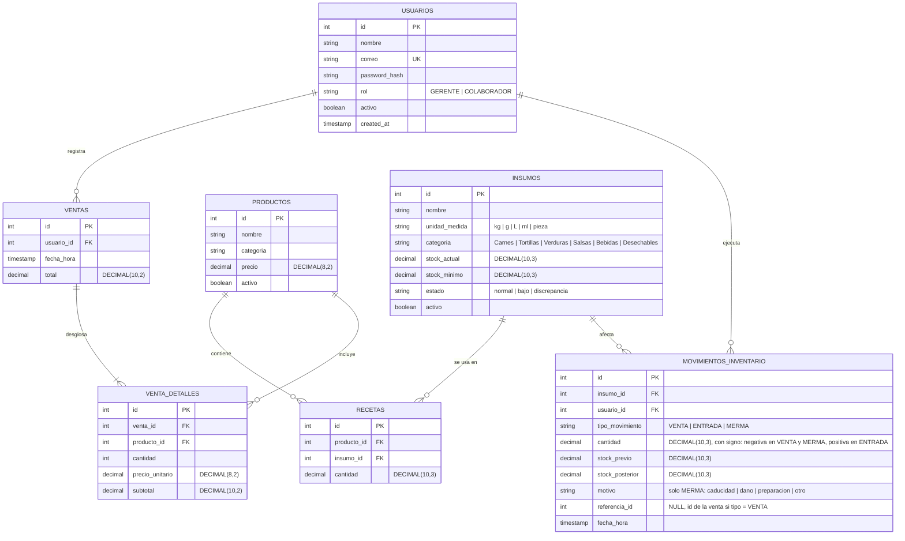

# Contrato Técnico — Tacos Tony Inventario Móvil

| Campo | Valor |
|---|---|
| Equipo / Autor(es) | Fernando León Del Río (Equipo 3: Alexander Yamil Alcázar Muroaga, Fernando León Del Río, Emiliano André Castaños Mejía) |
| Versión | 1.0 |
| Fecha | 2026-10-05 |
| Documento de origen | [01-vision-alcance_TacosTonyMovil_Leon.md](./01-vision-alcance_TacosTonyMovil_Leon.md) |
| Estado | En revisión |

> **Propósito de este documento:** La Etapa 1 explicó *qué* problema resolvemos y *por qué*. Este contrato define *cómo se verificará* que la solución funciona y *qué decisiones técnicas* se tomaron. Es el documento formal que se le entrega al desarrollador y al agente de IA para construir el MVP en la Etapa 3 y garantizar la trazabilidad de la solución.
>
> **Regla de oro:** No se repiten los requisitos de la Etapa 1; se referencian por su ID (RF-01, RNF-02...) y se agrega la precisión técnica requerida para codificar, desplegar y validar.

---

## 1. Contexto y Alcance del MVP

Tacos Tony Inventario Móvil es una aplicación web responsive diseñada con enfoque *mobile-first* para los colaboradores y el gerente de la sucursal Tacos Tony Camino Real. El sistema resuelve el descontrol de materias primas mediante la consulta ágil de stock desde celulares en cocina y bodega, el descuento automático de insumos en tiempo real basado en recetas ante ventas registradas, y el registro estructurado de mermas y entradas, eliminando compras a ciegas y pérdidas no identificadas. Para mayor detalle de la justificación operativa, problemática y entrevistas con el dueño, consultar [01-vision-alcance_TacosTonyMovil_Leon.md](./01-vision-alcance_TacosTonyMovil_Leon.md).

### Alcance del MVP

La siguiente tabla define el alcance funcional acordado para el MVP (Etapa 3). Todos los requisitos clasificados como **Debe (Must)** forman parte irrenunciable del MVP:

| ID | Requisito (título corto) | Prioridad | ¿Entra al MVP? | Justificación de inclusión o exclusión |
|---|---|---|---|---|
| RF-01 | Autenticación y control de acceso RBAC | Debe | Sí | Crítico: divide el acceso operativo del Colaborador frente a la gestión del Gerente. |
| RF-02 | Catálogo de insumos y desactivación lógica | Debe | Sí | Crítico: sin catálogo base no existe inventario que consultar ni descontar. |
| RF-03 | Configuración de recetas por producto | Debe | Sí | Crítico: vincula el menú con el consumo de materias primas (motor del sistema). |
| RF-04 | Captura manual de ventas | Debe | Sí | Crítico: mecanismo de simulación del punto de venta para alimentar la operación diaria. |
| RF-05 | Descuento por receta y discrepancias | Debe | Sí | Crítico: regla de negocio central que descuenta stock y alerta existencias negativas. |
| RF-06 | Registro de entradas por compra | Debe | Sí | Crítico: permite reabastecer el inventario cuando ingresa mercancía a la sucursal. |
| RF-07 | Registro de mermas con motivo | Debe | Sí | Crítico: visibiliza desperdicios, descomposición y mermas operativas desde bodega. |
| RF-08 | Consulta de existencias móvil y filtros | Debe | Sí | Crítico: caso de uso principal del Colaborador desde su teléfono en turno activo. |
| RF-09 | Alertas de stock bajo en dashboard | Debe | Sí | Crítico: notifica al Gerente inmediatamente cuando un insumo llega a su mínimo. |
| RF-10 | Historial inmutable de movimientos | Debe | Sí | Crítico: base de auditoría que registra cada entrada, salida y merma con autor y fecha. |
| RF-11 | Lista sugerida de reabastecimiento | Debería | No | Excluido del MVP: el algoritmo de consumo de 7 días se implementará en la fase v1.1. |
| RF-12 | Generación de pedidos de compra | Debería | No | Excluido del MVP: se gestiona de forma operativa externa durante la fase inicial. |
| RF-13 | Confirmación de recepción por colaborador | Debería | No | Excluido del MVP: las recepciones se registran directamente como entradas (RF-06). |
| RF-14 | Importación masiva de ventas vía CSV | Debería | No | Excluido del MVP: la captura manual (RF-04) cubre la simulación del MVP. |
| RF-15 | Reporte analítico de consumo y merma | Debería | No | Excluido del MVP: se sustituye temporalmente por la consulta del historial (RF-10). |
| RF-16 | Exportación de datos a formato CSV | Podría | No | Excluido del MVP: funcionalidad complementaria para etapas analíticas avanzadas. |

---

## 2. Decisiones de Arquitectura (ADR)

### ADR-01 — Arquitectura desacoplada API-First (Backend REST en Node.js/Express + Frontend SPA en React/Vite) para habilitar el complemento móvil (Etapa 6)

- **Contexto:** En el proyecto previo de Desarrollo Web de escritorio, la lógica de presentación y acceso a datos estaba centralizada. Para el inventario móvil de Tacos Tony se requiere una interfaz web responsive inmediata para navegadores móviles y, fundamentalmente, la arquitectura debe dejar preparado el camino para el **complemento móvil nativo/híbrido en la Etapa 6** sin duplicar lógica de backend ni reescribir controladores.
- **Opciones consideradas:**
  - *Opción A:* Monolito acoplado con Server-Side Rendering (SSR) tradicional (Node.js con EJS o PHP/Blade).
  - *Opción B:* Arquitectura desacoplada **API-First** (Backend REST en Node.js/Express que expone endpoints JSON puros + Frontend SPA ligero en React 18 con Vite).
  - *Opción C:* Framework híbrido full-stack Next.js con Server Actions.
- **Decisión:** Se elige la **Opción B: Arquitectura desacoplada API-First**.
- **Justificación:** Al separar el backend como una API RESTful sin estado (*stateless*), las reglas de negocio críticas (descuento automático de recetas, cálculo de stock y validación de mermas) residen exclusivamente en el servidor. La aplicación web responsive desarrollada en React/Vite consumirá esta API en la Etapa 3. Cuando se construya el complemento móvil en la **Etapa 6**, la app móvil podrá consumir los mismos contratos de API (`/api/insumos`, `/api/ventas`, `/api/movimientos`) con el mismo token de autenticación, reutilizando la lógica de negocio del servidor sin reescribirla; solo habrá que construir la capa de interfaz móvil.
- **Consecuencias:**
  - *Ganancias:* Reutilización total garantizada para la Etapa 6, separación clara de responsabilidades, pruebas unitarias y de integración de endpoints simplificadas mediante clientes HTTP (Postman/Supertest), y capacidad de desplegar cliente y servidor de forma independiente.
  - *Costos / Mitigaciones:* Requiere gestionar configuración de CORS y manejo explícito de autenticación basada en tokens JWT en el cliente en lugar de cookies de sesión automáticas.

---

### ADR-02 — Base de datos relacional MySQL 8.0 con transacciones ACID y precisión decimal fija (`DECIMAL(10,3)`)

- **Contexto:** El sistema previo de Tacos Tony ya utilizaba MySQL con un esquema base (`t_materiales`, `t_productos`, `t_necesitar_particular`). Además, el inventario gastronómico maneja materias primas fraccionadas (ej. 0.050 kg de carne por taco, 0.035 L de salsa) y operaciones compuestas donde la venta de un producto requiere descontar múltiples insumos en una sola operación sin inconsistencias.
- **Opciones consideradas:**
  - *Opción A:* Base de datos NoSQL documental (MongoDB), guardando recetas y stock en documentos JSON embebidos.
  - *Opción B:* Base de datos relacional MySQL 8.0 (motor InnoDB) con soporte formal para transacciones ACID y tipos numéricos `DECIMAL(10,3)`.
  - *Opción C:* Base de datos embebida SQLite local.
- **Decisión:** Se elige la **Opción B: MySQL 8.0 con InnoDB y tipos DECIMAL**.
- **Justificación:** La relación entre productos, recetas e insumos es intrínsecamente relacional (muchos a muchos). Cuando se registra una venta de 10 tacos al pastor, el sistema debe descontar simultáneamente carne, tortillas, cebolla, cilantro y salsa. El soporte de transacciones ACID (`START TRANSACTION`, `COMMIT`, `ROLLBACK`) en InnoDB garantiza que si la actualización de un insumo falla, ningún otro quede alterado. El uso de `DECIMAL(10,3)` previene los errores acumulativos de precisión que provocan los tipos de coma flotante (`FLOAT`/`DOUBLE`) al calcular recetas en gramos y mililitros. Además, preserva la compatibilidad con el entorno de base de datos del proyecto precedente.
- **Consecuencias:**
  - *Ganancias:* Consistencia matemática estricta en inventarios, transaccionalidad atómica robusta, integridad referencial mediante claves foráneas y continuidad con la infraestructura de la sucursal.
  - *Costos / Mitigaciones:* Los cambios en el modelo requieren scripts de migración formales y el esquema es más estricto que un modelo documental flexible.

---

### ADR-03 — Enfoque de interfaz Mobile-First con Tailwind CSS, ergonomía táctil (mínimo 48×48 px) y navegación inferior

- **Contexto:** El personal de cocina y bodega en Tacos Tony opera de pie, manipulando ingredientes, con una sola mano libre y pantallas compactas (360 px a 414 px de ancho). Una interfaz web de escritorio escalada hacia abajo o con controles pequeños (< 40 px) resulta inusable en el entorno real de servicio.
- **Opciones consideradas:**
  - *Opción A:* Interfaz tradicional de escritorio ajustada posteriormente mediante media queries genéricas (Desktop-First).
  - *Opción B:* Diseño estructurado **Mobile-First** con Tailwind CSS, barra de navegación inferior fija (*Bottom Navigation Bar*), áreas táctiles mínimas de 48×48 px y formularios verticales sin scroll horizontal.
  - *Opción C:* Biblioteca de componentes de escritorio pesada (Bootstrap 5 tradicional o Material-UI sin optimización).
- **Decisión:** Se elige la **Opción B: Mobile-First con Tailwind CSS y ergonomía táctil**.
- **Justificación:** Diseñar a partir del viewport base de 360 px garantiza que el contenido esencial (búsqueda rápida de existencias, formulario ágil de merma) sea accesible inmediatamente con el pulgar. Tailwind CSS genera un paquete de estilos purgado de menos de 25 KB, acelerando drásticamente el tiempo de carga en conexiones móviles en cocina (cumpliendo RNF-02 y RNF-03).
- **Consecuencias:**
  - *Ganancias:* Facilidad de uso para colaboradores con las manos ocupadas, eliminación total de scroll horizontal en smartphones y cumplimiento de los lineamientos de accesibilidad móvil (WCAG 2.1 touch target).
  - *Costos / Mitigaciones:* En pantallas de escritorio amplias, la interfaz se presenta en un contenedor centralizado de ancho controlado (máx. 768 px o modal flotante) para preservar la coherencia visual sin duplicar vistas.

---

### ADR-04 — Autenticación Stateless mediante JSON Web Tokens (JWT) con control de acceso basado en roles (RBAC) en middleware

- **Contexto:** El sistema cuenta con dos roles con atribuciones estrictamente separadas: el Colaborador solo consulta existencias y pedidos; el Gerente gestiona insumos, recetas, mermas y auditoría. La seguridad debe ser infranqueable tanto si la petición proviene del navegador web responsive como si en la Etapa 6 proviene de una aplicación móvil nativa.
- **Opciones consideradas:**
  - *Opción A:* Sesiones basadas en cookies gestionadas en memoria por el servidor web (`express-session`).
  - *Opción B:* Autenticación basada en **JWT (JSON Web Tokens)** transmitidos en la cabecera `Authorization: Bearer <token>`, con firma criptográfica HMAC-SHA256, expiración de 30 minutos de inactividad y validación mediante middleware `authorizeRole(['GERENTE'])`.
  - *Opción C:* Autenticación básica HTTP (Basic Auth).
- **Decisión:** Se elige la **Opción B: Autenticación Stateless JWT con middleware RBAC**.
- **Justificación:** Los tokens JWT no dependen de cookies de navegador, lo que permite que el mismo mecanismo de autenticación sirva de forma nativa a la futura app móvil en la Etapa 6. El control de acceso RBAC se aplica a nivel de middleware en cada ruta del backend antes de ejecutar cualquier lógica, asegurando que un Colaborador no pueda realizar modificaciones al inventario ni siquiera enviando peticiones manipuladas directamente por consola o API.
- **Consecuencias:**
  - *Ganancias:* Backend desacoplado y sin almacenamiento de sesión en RAM, interoperabilidad multiplataforma inmediata y protección rigurosa de endpoints.
  - *Costos / Mitigaciones:* El token se almacena de forma segura en `localStorage` o `sessionStorage` en el cliente web y se valida su tiempo de vida de 30 minutos (RNF-05).

---

## 3. Modelo de Datos e Interfaces

### 3.1 Modelo de Datos

El modelo de datos evoluciona el esquema de la entrega anterior de Desarrollo Web (`Entrega Final_DW.pdf`), depurando entidades administrativas accesorias (facturación de clientes, sueldos) y consolidando un esquema relacional optimizado para control de inventario móvil, recetas precisas y trazabilidad estricta.



> **Reglas del modelo:** (1) `estado` de un insumo se recalcula en cada movimiento: `discrepancia` si `stock_actual < 0`; `bajo` si `0 <= stock_actual <= stock_minimo`; `normal` en otro caso. (2) La tabla `movimientos_inventario` es solo de inserción; una corrección se registra como un movimiento nuevo (RNF-06).

#### Descripción de adaptaciones respecto al sistema original de escritorio:
1. **`USUARIOS` (adaptación de `t_empleados`):** Se removieron campos de nómina (`salario`, `telefono`) y se añadieron `rol` ('GERENTE' o 'COLABORADOR'), `password_hash` seguro y bandera `activo` para control de acceso.
2. **`INSUMOS` (adaptación de `t_materiales`):** Se incorporaron `unidad_medida`, `categoria`, `stock_minimo`, `estado` calculado ('normal', 'bajo', 'discrepancia') y `activo` para posibilitar el borrado lógico exigido por RF-02.
3. **`RECETAS` (adaptación de `t_necesitar_general` y `t_necesitar_particular`):** Se unificó en una tabla de asociación directa `PRODUCTO-INSUMO` con campo `cantidad` en `DECIMAL(10,3)`, eliminando la sobrecomplejidad de dobles cabeceras para facilitar la edición ágil en celular.
4. **`MOVIMIENTOS_INVENTARIO` (nueva entidad fundamental):** En el sistema previo no existía un libro mayor inmutable de movimientos. Esta tabla asegura el cumplimiento de RF-10 y RNF-06, auditando cada descuento por venta, entrada por compra y merma con autor, fecha, stocks previos y posteriores.

---

### 3.2 Contratos de Interfaz (API RESTful)

Todos los endpoints responden en formato JSON. Las rutas protegidas requieren la cabecera `Authorization: Bearer <token_jwt>`.

#### 1. Autenticación de Usuario
- **Ruta:** `POST /api/auth/login`
- **Descripción:** Valida credenciales del usuario y genera un token JWT con el rol asignado.
- **Entrada (Request Body):**
```json
{
  "correo": "gerente@tacostony.com",
  "password": "PasswordSegura123!"
}
```
- **Salida Exitosa (200 OK):**
```json
{
  "token": "eyJhbGciOiJIUzI1NiIsInR5cCI6IkpXVCJ9...",
  "usuario": {
    "id": 1,
    "nombre": "Gerente Demo",
    "correo": "gerente@tacostony.com",
    "rol": "GERENTE"
  }
}
```
- **Errores:**
  - `400 Bad Request`: `{ "error": "Correo y contraseña son requeridos" }`
  - `401 Unauthorized`: `{ "error": "Credenciales inválidas" }`
  - `403 Forbidden`: `{ "error": "Usuario inactivo en el sistema" }`

---

#### 2. Consulta de Existencias de Insumos
- **Ruta:** `GET /api/insumos`
- **Descripción:** Retorna el catálogo de insumos con stock y estado actual. Permite búsqueda y filtros. Accesible para **Gerente** y **Colaborador**.
- **Parámetros de Consulta (Query Params):** `?busqueda=pastor&categoria=Carnes&estado=bajo`
- **Entrada:** Ninguna (parámetros opcionales en URL).
- **Salida Exitosa (200 OK):**
```json
[
  {
    "id": 12,
    "nombre": "Carne de Cerdo al Pastor",
    "unidad_medida": "kg",
    "categoria": "Carnes",
    "stock_actual": 4.500,
    "stock_minimo": 8.000,
    "estado": "bajo",
    "activo": true
  }
]
```
- **Errores:**
  - `401 Unauthorized`: `{ "error": "Token no proporcionado o expirado" }`
  - `500 Internal Server Error`: `{ "error": "Error interno al consultar existencias" }`

---

#### 3. Alta de Nuevo Insumo
- **Ruta:** `POST /api/insumos`
- **Descripción:** Da de alta un nuevo insumo en el catálogo. Exclusivo para rol **Gerente**.
- **Entrada (Request Body):**
```json
{
  "nombre": "Cebolla Blanca",
  "unidad_medida": "kg",
  "categoria": "Verduras",
  "stock_inicial": 10.000,
  "stock_minimo": 3.000
}
```
- **Salida Exitosa (201 Created):**
```json
{
  "id": 18,
  "nombre": "Cebolla Blanca",
  "unidad_medida": "kg",
  "categoria": "Verduras",
  "stock_actual": 10.000,
  "stock_minimo": 3.000,
  "estado": "normal",
  "activo": true
}
```
- **Errores:**
  - `400 Bad Request`: `{ "error": "Unidad de medida inválida o campos incompletos" }`
  - `401 Unauthorized`: `{ "error": "No autenticado" }`
  - `403 Forbidden`: `{ "error": "Acceso restringido: solo el Gerente puede dar de alta insumos" }`
  - `409 Conflict`: `{ "error": "Ya existe un insumo activo con ese nombre" }`

---

#### 4. Registro de Venta con Descuento Automático por Receta
- **Ruta:** `POST /api/ventas`
- **Descripción:** Registra una venta simulada y ejecuta la transacción atómica de descuento de recetas sobre los insumos correspondientes. Exclusivo para rol **Gerente**.
- **Entrada (Request Body):**
```json
{
  "items": [
    {
      "producto_id": 1,
      "cantidad": 5
    },
    {
      "producto_id": 4,
      "cantidad": 2
    }
  ]
}
```
- **Salida Exitosa (201 Created):**
```json
{
  "venta_id": 104,
  "fecha_hora": "2026-10-06T19:30:00Z",
  "total": 135.00,
  "discrepancias_detectadas": [
    {
      "insumo_id": 5,
      "insumo_nombre": "Tortilla de Maíz",
      "stock_resultante": -2.000,
      "mensaje": "Stock resultante negativo. Marcado con discrepancia."
    }
  ],
  "mensaje": "Venta registrada exitosamente con descuento automático de insumos"
}
```
- **Errores:**
  - `400 Bad Request`: `{ "error": "La venta debe incluir al menos un producto con cantidad positiva" }`
  - `401 Unauthorized`: `{ "error": "No autenticado" }`
  - `403 Forbidden`: `{ "error": "Permisos insuficientes" }`
  - `422 Unprocessable Entity`: `{ "error": "El producto con ID 9 no tiene una receta configurada" }`

---

#### 5. Registro de Merma de Insumo
- **Ruta:** `POST /api/mermas`
- **Descripción:** Registra el desperdicio o pérdida física de un insumo, restándolo del stock y generando movimiento. Exclusivo para rol **Gerente**.
- **Entrada (Request Body):**
```json
{
  "insumo_id": 12,
  "cantidad": 1.250,
  "motivo": "caducidad",
  "observaciones": "Carne preparada no consumida tras cierre de turno dominical"
}
```
- **Salida Exitosa (201 Created):**
```json
{
  "movimiento_id": 312,
  "insumo_id": 12,
  "insumo_nombre": "Carne de Cerdo al Pastor",
  "cantidad_descontada": 1.250,
  "stock_anterior": 4.500,
  "stock_nuevo": 3.250,
  "nuevo_estado": "bajo",
  "fecha_hora": "2026-10-06T20:15:00Z"
}
```
- **Errores:**
  - `400 Bad Request`: `{ "error": "Cantidad debe ser mayor a 0 y motivo válido (caducidad, dano, preparacion, otro)" }`
  - `403 Forbidden`: `{ "error": "Acceso denegado: solo el Gerente puede registrar mermas" }`
  - `404 Not Found`: `{ "error": "Insumo no encontrado o inactivo" }`

---

#### 6. Consulta de Historial de Movimientos de Inventario
- **Ruta:** `GET /api/movimientos`
- **Descripción:** Consulta el historial inmutable de movimientos con filtros por rango de fecha, tipo de movimiento e insumo. Exclusivo para rol **Gerente**.
- **Parámetros de Consulta (Query Params):** `?fecha_inicio=2026-10-01&fecha_fin=2026-10-06&tipo=MERMA&insumo_id=12`
- **Entrada:** Ninguna (parámetros en URL).
- **Salida Exitosa (200 OK):**
```json
[
  {
    "id": 312,
    "fecha_hora": "2026-10-06T20:15:00Z",
    "tipo_movimiento": "MERMA",
    "insumo_id": 12,
    "insumo_nombre": "Carne de Cerdo al Pastor",
    "cantidad": -1.250,
    "stock_previo": 4.500,
    "stock_posterior": 3.250,
    "motivo": "caducidad",
    "usuario_nombre": "Gerente Demo"
  }
]
```
- **Errores:**
  - `401 Unauthorized`: `{ "error": "Token ausente o inválido" }`
  - `403 Forbidden`: `{ "error": "Solo el Gerente puede auditar el historial de movimientos" }`
- **Nota de inmutabilidad:** no existen rutas `PUT`/`PATCH`/`DELETE` sobre `/api/movimientos`; cualquier intento responde `405` (ver CA-10.2).

---

#### 7. Registro de Entrada de Insumo por Compra
- **Ruta:** `POST /api/entradas`
- **Descripción:** Registra una entrada por compra, suma la cantidad al stock y genera el movimiento `ENTRADA` (RF-06). Exclusivo para rol **Gerente**.
- **Entrada (Request Body):**
```json
{
  "insumo_id": 12,
  "cantidad": 20.000,
  "fecha": "2026-10-05"
}
```
- **Salida Exitosa (201 Created):**
```json
{
  "movimiento_id": 313,
  "insumo_id": 12,
  "stock_anterior": 3.000,
  "stock_nuevo": 23.000,
  "nuevo_estado": "normal"
}
```
- **Errores:**
  - `400 Bad Request`: `{ "error": "La cantidad de entrada debe ser superior a cero" }`
  - `403 Forbidden`: `{ "error": "Acceso denegado: solo el Gerente puede registrar entradas" }`
  - `404 Not Found`: `{ "error": "Insumo no encontrado o inactivo" }`

---

#### 8. Alta de Producto y Configuración de su Receta
- **Rutas:** `POST /api/productos` (alta del producto) y `PUT /api/productos/:id/receta` (reemplaza la receta completa). Exclusivas para rol **Gerente** (RF-03).
- **Entrada de `PUT /api/productos/:id/receta`:**
```json
{
  "ingredientes": [
    { "insumo_id": 7, "cantidad": 0.080 },
    { "insumo_id": 5, "cantidad": 1.000 }
  ]
}
```
- **Salida Exitosa:** `201 Created` en el alta de producto `{ "id": 4, "nombre": "Taco de Bistec", "precio": 25.00, "activo": true }`; `200 OK` al guardar la receta `{ "producto_id": 4, "ingredientes": [ ... ] }`.
- **Errores:**
  - `400 Bad Request`: `{ "error": "La cantidad del insumo en la receta debe ser un número positivo mayor a cero" }`
  - `403 Forbidden`: `{ "error": "Acceso restringido: solo el Gerente puede configurar recetas" }`
  - `404 Not Found`: `{ "error": "Producto o insumo no encontrado" }`

---

#### 9. Desactivación de Insumo
- **Ruta:** `PATCH /api/insumos/:id/desactivar`
- **Descripción:** Desactivación lógica (`activo = false`); nunca borra el registro (RF-02). Exclusivo para rol **Gerente**.
- **Entrada:** Ninguna.
- **Salida Exitosa (200 OK):** `{ "id": 12, "activo": false }`
- **Errores:**
  - `403 Forbidden`: `{ "error": "Acceso restringido: solo el Gerente puede desactivar insumos" }`
  - `404 Not Found`: `{ "error": "Insumo no encontrado" }`

---

## 4. Criterios de Aceptación (Given / When / Then)

Todos los criterios están formulados para validarse de forma binaria (**PASA / NO PASA**).

### RF-01 — Autenticación y control de acceso basado en roles

#### CA-01.1 (Camino feliz)
- **Given** un usuario con rol "Colaborador" y credenciales registradas válidas en la base de datos
- **When** introduce su correo y contraseña en el formulario de inicio de sesión y presiona "Ingresar"
- **Then** el sistema responde con código HTTP 200, devuelve un token JWT con rol "COLABORADOR", y el frontend lo redirige automáticamente a la pantalla de Existencias (`/existencias`), manteniendo bloqueadas y no visibles las opciones de Altas, Mermas y Ajustes.

#### CA-01.2 (Caso de error)
- **Given** un usuario que introduce un correo registrado pero una contraseña incorrecta
- **When** envía el formulario de inicio de sesión
- **Then** el sistema responde con código HTTP 401 Unauthorized, muestra en pantalla el mensaje "Credenciales inválidas" sin especificar si falló el correo o la clave, y no emite ningún token de acceso.

#### CA-01.3 (Caso límite)
- **Given** un usuario que ha iniciado sesión exitosamente pero deja la aplicación inactiva durante más de 30 minutos
- **When** intenta realizar cualquier petición de lectura o escritura en la aplicación
- **Then** el middleware de backend rechaza la petición con código HTTP 401 por token expirado, y la interfaz lo redirige de inmediato a la pantalla de Login con el mensaje "Tu sesión ha expirado por inactividad".

---

### RF-02 — Gestión del catálogo de insumos y desactivación lógica

#### CA-02.1 (Camino feliz)
- **Given** un usuario autenticado con rol "Gerente" en la pantalla de gestión de insumos
- **When** completa el formulario con nombre "Cilantro Fresco", unidad de medida "kg", categoría "Verduras", stock inicial "2.000" y stock mínimo "0.500", y presiona "Guardar"
- **Then** el sistema almacena el insumo en la tabla `INSUMOS`, retorna código HTTP 201 Created y el nuevo insumo se muestra inmediatamente en la lista de existencias en estado "normal".

#### CA-02.2 (Caso de error)
- **Given** una petición HTTP `POST /api/insumos` enviada con el token JWT de un usuario con rol "Colaborador"
- **When** la petición llega al servidor
- **Then** el middleware de backend intercepta la llamada, responde con código HTTP 403 Forbidden con el mensaje "Acceso restringido: solo el Gerente puede dar de alta insumos", y la base de datos no sufre ninguna alteración.

#### CA-02.3 (Caso límite)
- **Given** un insumo existente ("Carne al Pastor") que ya cuenta con 15 registros asociados en `MOVIMIENTOS_INVENTARIO`
- **When** el Gerente selecciona la opción "Desactivar insumo" (`PATCH /api/insumos/:id/desactivar`)
- **Then** el sistema no ejecuta un `DELETE` físico en la base de datos; en su lugar, actualiza el campo `activo = false` (desactivación lógica), responde HTTP 200, preserva íntegro el historial previo y oculta el insumo del catálogo de selección para nuevas recetas y ventas.

---

### RF-03 — Configuración de recetas por producto del menú

#### CA-03.1 (Camino feliz)
- **Given** un producto del menú dado de alta ("Taco de Bistec") y los insumos "Bistec de Res", "Tortilla de Maíz" y "Cebolla Blanca"
- **When** el Gerente asigna a la receta las cantidades "0.080 kg" de Bistec, "1 pieza" de Tortilla y "0.015 kg" de Cebolla, y confirma la acción
- **Then** el sistema almacena las tres relaciones en la tabla `RECETAS`, responde HTTP 201 Created y confirma en pantalla "Receta de Taco de Bistec configurada exitosamente".

#### CA-03.2 (Caso de error)
- **Given** el Gerente intentando configurar la receta de un producto
- **When** ingresa un insumo con cantidad negativa o cero ("-0.050 kg")
- **Then** el sistema rechaza la operación tanto en el formulario web como en la API con código HTTP 400 Bad Request y el mensaje "La cantidad del insumo en la receta debe ser un número positivo mayor a cero".

#### CA-03.3 (Caso límite)
- **Given** la receta de un producto que utiliza una porción muy pequeña de materia prima ("0.003 kg" de Sal o condimento)
- **When** el Gerente guarda la receta en el sistema
- **Then** el valor se almacena en la columna `DECIMAL(10,3)` como exactamente `0.003` sin redondearse a cero ni sufrir pérdida de precisión numérica de punto flotante.

---

### RF-04 — Captura manual de ventas

#### CA-04.1 (Camino feliz)
- **Given** un Gerente autenticado en el módulo de ventas
- **When** selecciona "Taco al Pastor" con cantidad 4, "Taco de Bistec" con cantidad 2 y presiona "Confirmar Venta"
- **Then** el sistema crea el registro maestro en `VENTAS`, inserta los dos registros en `VENTA_DETALLES`, responde con HTTP 201 Created y muestra el resumen con el importe total calculado.

#### CA-04.2 (Caso de error)
- **Given** un usuario que intenta enviar el formulario de venta
- **When** no selecciona ningún producto o envía un arreglo vacío de artículos (`items: []`)
- **Then** el backend responde con código HTTP 400 Bad Request con el mensaje "La venta debe incluir al menos un producto válido" y no descuenta nada del inventario.

#### CA-04.3 (Caso límite)
- **Given** un registro de venta de gran volumen que contiene 10 partidas de productos diferentes que en conjunto involucran 18 insumos distintos
- **When** se envía la petición de venta al servidor
- **Then** la operación completa se ejecuta dentro de una única transacción SQL en menos de 1.5 segundos; si la actualización del insumo 18 llegara a fallar, la transacción completa hace `ROLLBACK` sin dejar ventas huérfanas ni descuentos parciales.

---

### RF-05 — Descuento automático por receta y detección de discrepancias (*Regla de Negocio no trivial*)

#### CA-05.1 (Camino feliz — Regla de negocio no trivial)
- **Given** el insumo "Tortilla de Maíz" con stock inicial de 100 piezas y una receta de "Taco al Pastor" que consume 2 tortillas por unidad
- **When** el Gerente registra la venta de 15 Tacos al Pastor
- **Then** el sistema descuenta automáticamente `15 * 2 = 30` tortillas, dejando el stock actual en exactamente 70 piezas, y crea un registro en `MOVIMIENTOS_INVENTARIO` con `tipo_movimiento = 'VENTA'`, `cantidad = -30.000`, `stock_previo = 100.000` y `stock_posterior = 70.000`.

#### CA-05.2 (Caso de error / Excepción de negocio no trivial)
- **Given** el insumo "Carne al Pastor" con stock registrado de 1.000 kg y una receta que requiere 0.080 kg por taco
- **When** el Gerente registra la venta de 20 Tacos al Pastor (consumo requerido: `1.600 kg`, superando el stock disponible)
- **Then** la venta **NO se bloquea**, el sistema permite el registro de la venta, descuenta los 1.600 kg dejando el stock en `-0.600 kg`, actualiza el estado del insumo a **"discrepancia"** y emite una advertencia visual destacada en la respuesta y en el dashboard indicando stock negativo para revisión del Gerente.

#### CA-05.3 (Caso límite)
- **Given** un insumo cuyo stock actual es exactamente igual al consumo de la venta (ej. 5.000 L de salsa con consumo de venta de 5.000 L)
- **When** se procesa la venta
- **Then** el stock resultante queda en exactamente `0.000 L`, su estado cambia a "bajo" (por ser menor o igual a su stock mínimo) y **no** se clasifica como discrepancia al no ser un número negativo.

---

### RF-06 — Registro de entradas de insumos por compra

#### CA-06.1 (Camino feliz)
- **Given** el insumo "Carne al Pastor" con stock actual de 3.000 kg
- **When** el Gerente registra una entrada por compra de 20.000 kg con fecha y hora actuales
- **Then** el stock se incrementa a 23.000 kg, el estado del insumo pasa a "normal" y se añade un registro a `MOVIMIENTOS_INVENTARIO` con `tipo_movimiento = 'ENTRADA'`, `cantidad = 20.000`, `stock_previo = 3.000` y `stock_posterior = 23.000`.

#### CA-06.2 (Caso de error)
- **Given** el formulario de entrada de insumos
- **When** el usuario introduce una cantidad menor o igual a cero ("0" o "-5.000")
- **Then** el sistema bloquea el envío con un error de validación HTTP 400 indicando "La cantidad de entrada debe ser superior a cero" y no modifica las existencias.

#### CA-06.3 (Caso límite)
- **Given** una compra que ingresa con peso decimal fraccionario de báscula de proveedor (ej. 15.375 kg de cebolla)
- **When** se guarda la entrada
- **Then** el sistema suma exactamente los 15.375 kg al stock previo conservando los tres dígitos decimales en la base de datos sin truncar decimales.

---

### RF-07 — Registro de mermas con motivo categorizado

#### CA-07.1 (Camino feliz)
- **Given** un insumo "Salsa Verde" con stock de 4.000 L
- **When** el Gerente registra una merma de 1.500 L seleccionando el motivo "caducidad" y confirma en menos de 4 toques táctiles desde la pantalla principal
- **Then** el stock del insumo queda en 2.500 L, el sistema responde HTTP 201 Created y se guarda en `MOVIMIENTOS_INVENTARIO` con `tipo_movimiento = 'MERMA'` y `motivo = 'caducidad'`.

#### CA-07.2 (Caso de error)
- **Given** una petición para registrar merma
- **When** se omite el campo obligatorio de motivo o se envía una cadena no reconocida en el catálogo de motivos
- **Then** el backend rechaza la petición con código HTTP 400 Bad Request y el mensaje "El motivo de la merma es obligatorio y debe ser: caducidad, dano, preparacion u otro".

#### CA-07.3 (Caso límite)
- **Given** un insumo con stock de 0.800 kg
- **When** se registra una merma por exactamente 0.800 kg con motivo "dano"
- **Then** el stock resultante queda en 0.000 kg, el estado del insumo cambia automáticamente a "bajo", el sistema registra el movimiento y no genera errores de inconsistencia.

---

### RF-08 — Consulta de existencias, búsqueda y filtrado multi-criterio

#### CA-08.1 (Camino feliz)
- **Given** un Colaborador en cocina utilizando su teléfono celular en `/existencias`
- **When** teclea "pastor" en el campo de búsqueda y selecciona el filtro de categoría "Carnes"
- **Then** la lista filtra en tiempo real en menos de 300 ms, mostrando exclusivamente la tarjeta de "Carne de Cerdo al Pastor" con su stock actual (ej. 4.500 kg), unidad y estado visual mediante un indicador de color.

#### CA-08.2 (Caso de error / Estado vacío)
- **Given** un usuario que realiza una búsqueda con un término que no coincide con ningún insumo (ej. "mariscos")
- **When** se aplica el filtro
- **Then** la aplicación no muestra errores de consola ni se congela; muestra un componente de estado vacío accesible: "No se encontraron insumos que coincidan con la búsqueda" con un botón para limpiar filtros.

#### CA-08.3 (Caso límite)
- **Given** un teléfono móvil con pantalla estrecha de 360 px de ancho (ej. Galaxy A10) mostrando un insumo con nombre largo ("Tortilla de Maíz Nixtamalizada Especial para Taco")
- **When** el usuario visualiza la tarjeta del insumo
- **Then** el nombre se ajusta verticalmente mediante saltos de línea sin desbordar el contenedor, los números de stock permanecen legibles y la pantalla tiene exactamente 0 px de desplazamiento horizontal.

---

### RF-09 — Alertas de stock bajo en dashboard (*Interacción entre Módulos*)

#### CA-09.1 (Camino feliz — Interacción entre Módulos 2, 1 y 3)
- **Given** el insumo "Carne al Pastor" (Módulo 1) con stock mínimo de 8.000 kg y stock actual de 9.000 kg
- **When** el Gerente registra en el Módulo 2 una venta que consume 2.500 kg de carne
- **Then** el Módulo 2 descuenta la cantidad dejando el stock en 6.500 kg en el Módulo 1, el Módulo 1 actualiza su estado a "bajo" (`stock_actual <= stock_minimo`) y el Módulo 3 activa y muestra inmediatamente una tarjeta de alerta roja en el dashboard principal del Gerente indicando "Stock bajo: Carne al Pastor (6.500 kg restantes)".

#### CA-09.2 (Caso de error / Condición de no activación)
- **Given** un insumo con stock actual de 15.000 kg y stock mínimo de 5.000 kg
- **When** una venta consume 2.000 kg, dejando el stock en 13.000 kg
- **Then** el sistema actualiza el stock pero **no** modifica el estado a "bajo" y el dashboard no genera ninguna alerta para dicho insumo.

#### CA-09.3 (Caso límite)
- **Given** un insumo con stock mínimo de 3.000 kg y stock actual de 3.500 kg
- **When** el Gerente registra una merma de 0.500 kg, dejando el stock en exactamente 3.000 kg
- **Then** el insumo cambia a estado "bajo" (porque `stock_actual <= stock_minimo`, la igualdad cuenta) y aparece en la alerta del dashboard.

---

### RF-10 — Historial inmutable de movimientos (*Interacción entre Módulos y Auditoría*)

#### CA-10.1 (Camino feliz — Interacción entre Módulos 2, 1 y 3)
- **Given** el insumo "Cebolla Blanca" (Módulo 1) con stock de 2.000 kg y stock mínimo de 3.000 kg, por lo que aparece en estado "bajo" y en la alerta del dashboard del Gerente (Módulo 3)
- **When** el Gerente registra en el Módulo 2 una entrada por compra de 10.000 kg
- **Then** el Módulo 1 actualiza el stock a 12.000 kg y el estado a "normal", el Módulo 3 retira el insumo de la alerta de stock bajo, y el Módulo 2 guarda un movimiento inmutable con fecha y hora, ID del Gerente, `tipo_movimiento = 'ENTRADA'`, `cantidad = 10.000`, `stock_previo = 2.000` y `stock_posterior = 12.000`, visible de inmediato en `GET /api/movimientos`.

#### CA-10.2 (Caso de error / Inmutabilidad)
- **Given** un usuario malintencionado que intenta enviar una petición HTTP `DELETE` o `PUT` a la ruta `/api/movimientos/45` para alterar un movimiento previo
- **When** la petición llega al servidor
- **Then** el backend responde con código HTTP 405 Method Not Allowed o 403 Forbidden, no existe ningún controlador que permita modificar el historial y la base de datos permanece inmutable.

#### CA-10.3 (Caso límite)
- **Given** una consulta al historial de movimientos aplicando simultáneamente filtros de rango de fechas (últimos 30 días), tipo "VENTA" e insumo "Carne al Pastor" sobre un volumen de 1,500 movimientos registrados
- **When** se solicita la consulta desde el celular
- **Then** el backend ejecuta la consulta paginada (`LIMIT 25 OFFSET 0`) utilizando índices sobre `insumo_id` y `fecha_hora`, devolviendo el resultado en menos de 500 ms sin sobrecargar la memoria del dispositivo móvil.

---

## 5. Requisitos No Funcionales Verificables

| ID | Categoría | Criterio medible | Cómo se verifica |
|---|---|---|---|
| RNF-01 | Rendimiento | El descuento de insumos en base a recetas y la actualización de stock en base de datos tras registrar una venta debe completarse en un tiempo de respuesta p95 menor a 1.5 segundos (máximo absoluto 2.0 s), medido en 20 ventas de prueba consecutivas. | Prueba automatizada con script de carga ligero (k6 o script Node.js con `performance.now()`), midiendo la latencia de red y procesamiento del endpoint `POST /api/ventas`. |
| RNF-02 | Rendimiento | La pantalla de existencias (`/existencias`) debe cargar y estar completamente interactiva (Time to Interactive - TTI) en menos de 3.0 segundos con una conexión móvil 4G simulada (latencia 150 ms, bajada 1.6 Mbps). | Auditoría con Google Chrome DevTools en la pestaña *Performance / Lighthouse* en perfil Mobile aplicando throttling de red "Fast 3G / Slow 4G". |
| RNF-03 | Compatibilidad | El 100% de las pantallas y formularios deben operarse sin desplazamiento horizontal (ancho exacto del layout menor o igual al ancho de la ventana) en resoluciones desde 360 px hasta 1280 px, y renderizar idénticamente en Chrome (Android 12+) y Safari (iOS 16+). | Pruebas visuales en emulador de dispositivos de Chrome DevTools (360×640, 390×844, 412×915) y verificación con regla CSS `document.documentElement.scrollWidth <= window.innerWidth`. |
| RNF-04 | Usabilidad | Todos los botones interactivos, campos de entrada y elementos de lista deben poseer un área táctil mínima de 48×48 px. El flujo de registro de una merma no debe requerir más de 4 toques táctiles partiendo desde la pantalla principal. | Inspección de dimensiones en DevTools (bounding rect mayor o igual a 48×48 px) y prueba de usabilidad con cronómetro y conteo de toques con 3 usuarios de prueba. |
| RNF-05 | Seguridad | Las contraseñas deben almacenarse utilizando hash robusto con algoritmo `bcrypt` (factor de costo mayor o igual a 10). La sesión expira automáticamente tras 30 minutos de inactividad. El 100% de las rutas mutables (`POST`, `PUT`, `DELETE`) deben validar el rol en el backend. | Revisión de código estática, inspección directa de hashes en MySQL y pruebas de penetración enviando peticiones autenticadas como Colaborador hacia rutas de Gerente esperando código 403. |
| RNF-06 | Trazabilidad | El 100% de las alteraciones de inventario deben registrarse en la tabla inmutable `movimientos_inventario` con timestamp, usuario responsable y stocks. No existirá ningún endpoint ni sentencia SQL en el código que ejecute `UPDATE` o `DELETE` sobre dicha tabla. | Inspección de código del backend (búsqueda de sentencias SQL destructivas) e intento intencional de borrado vía cliente HTTP verificando el rechazo por el servidor. |

---

## 6. Fuera de Alcance Técnico

Para acotar el esfuerzo del MVP y prevenir desvíos de desarrollo no contemplados en los requisitos, se definen explícitamente las siguientes exclusiones técnicas:

1. **Sin integración física con hardware POS:** No se desarrollará comunicación directa con impresoras térmicas de tickets, terminales bancarias ni básculas electrónicas; las cantidades se capturan o simulan manualmente.
2. **Sin pasarelas de pago ni dispersión de fondos:** El sistema no procesa cobros a clientes (tarjetas, transferencias) ni pagos a proveedores de carne o verduras.
3. **Sin sincronización offline bidireccional compleja:** El MVP requiere conexión activa a internet/red local para operar, evitando la complejidad de resolución de conflictos distribuidos en SQLite local para garantizar la consistencia ACID en MySQL.
4. **Sin publicación en tiendas móviles en esta etapa:** No se compilarán paquetes `.apk` ni `.ipa` para Google Play Store o Apple App Store en el MVP; se desplegará como Web App Mobile-First en navegador, preparando el terreno para la Etapa 6.
5. **Sin soporte multi-sucursal:** El modelo y los controladores están optimizados exclusivamente para la sucursal Tacos Tony Camino Real; no se soportan catálogos divididos ni traspasos entre sucursales.
6. **Sin módulos de nómina o contabilidad general:** No se incluirá gestión de salarios de taqueros, cálculo de impuestos, retenciones de IMSS ni facturación electrónica CFDI.

---

## 7. Supuestos y Preguntas Abiertas

| # | Supuesto o pregunta | Responsable | Estado | Mitigación / Acuerdo |
|---|---|---|---|---|
| 1 | **Validación de recetas estándar:** Se asume que el gerente validará las cantidades aproximadas de los productos del menú que se carguen en el MVP antes de la Etapa 3 (riesgo de recetas no estandarizadas de la Etapa 1). | Equipo 3 / Gerente | Abierta | Se agendará una sesión de trabajo con el gerente; las cantidades podrán ajustarse desde la interfaz (RF-03). |
| 2 | **Dispositivos móviles del personal:** Se asume que gerente y colaboradores tienen un celular con navegador actualizado (Chrome/Safari, últimas dos versiones) y acceso a internet durante el turno (supuesto de la Etapa 1). | Equipo 3 | Abierta | Confirmarlo con la sucursal antes de la Etapa 3. |
| 3 | **Tolerancia en discrepancias por merma en plancha:** ¿Qué margen de tolerancia se considerará aceptable entre la carne pesada en crudo y la carne servida en tacos antes de obligar a un ajuste de inventario físico formal? | Emiliano Castaños / Gerente | Abierta | Se iniciará con tolerancia libre registrando discrepancias informativas en el MVP; en la Etapa 4 se evaluará establecer un umbral porcentual (ej. 15% por cocción). |
| 4 | **Entorno de base de datos para pruebas del MVP:** ¿Se utilizará una instancia de MySQL en la nube (Railway/PlanetScale/Render) o un túnel seguro hacia el servidor local de la sucursal? | Equipo 3 | En evaluación técnica | Para el desarrollo y evaluación académica se desplegará una base de datos MySQL en la nube (Railway) con datos semilla de prueba. |

---

## 8. Contexto para el Asistente de IA

> **INSTRUCCIONES PARA EL AGENTE DE IA (Copilot / Gemini / Claude):**
> Este bloque contiene el contexto obligatorio y directrices estrictas que debes acatar durante la generación de código del MVP en la Etapa 3. No te desvíes de estas convenciones.

- **Stack Tecnológico:**
  - **Frontend:** React 18+ con Vite, JavaScript/TypeScript, Tailwind CSS para estilos *mobile-first*, Lucide React para iconografía táctil y Axios para consumo de API.
  - **Backend:** Node.js (v20+ LTS) con Express, JavaScript modular (ES Modules), `mysql2/promise` para conexiones a base de datos, `bcryptjs` para hashing de contraseñas y `jsonwebtoken` (JWT) para autenticación sin estado.
  - **Base de Datos:** MySQL 8.0 (motor InnoDB) con esquema relacional normalizado y campos de existencias definidos como `DECIMAL(10,3)`.
  - **Pruebas:** Vitest / Jest para lógica de negocio, Supertest para contratos de endpoints y Google Lighthouse para métricas móviles.

- **Estructura del Proyecto:**
  ```text
  /tacos-tony-inventario
  ├── /backend
  │   ├── /src
  │   │   ├── /config       # Conexión a MySQL (pool de conexiones) y variables de entorno
  │   │   ├── /controllers  # Controladores (auth, insumos, recetas, ventas, mermas, movimientos)
  │   │   ├── /middlewares  # authMiddleware (JWT verify) y roleMiddleware (RBAC)
  │   │   ├── /models       # Consultas y transacciones SQL parametrizadas
  │   │   ├── /routes       # Enrutadores Express (/api/auth, /api/insumos, etc.)
  │   │   └── app.js        # Configuración de Express, CORS y servidor
  │   └── package.json
  ├── /frontend
  │   ├── /src
  │   │   ├── /components   # Botones táctiles, tarjetas de insumo, navbar inferior móvil, modales
  │   │   ├── /context      # AuthContext (almacenamiento de token y rol)
  │   │   ├── /pages        # Login, Existencias (móvil), RegistroVenta, Mermas, Movimientos
  │   │   ├── /services     # Cliente Axios y llamadas a endpoints (/api/...)
  │   │   └── App.jsx
  │   └── package.json
  └── README.md
  ```

- **Convenciones de Código:**
  - Rutas de API en minúsculas, plural y en inglés (`/api/insumos`, `/api/ventas`, `/api/movimientos`).
  - Nombres de tablas y columnas de base de datos en `snake_case` (`stock_actual`, `stock_minimo`, `password_hash`).
  - Nombres de componentes React en `PascalCase` (`InsumoCard.jsx`, `BottomNav.jsx`).
  - Funciones y variables en `camelCase` (`descontarInsumosPorReceta`, `obtenerExistencias`).
  - Idioma: Código y variables en inglés/español técnico; **todos los mensajes de error, etiquetas de interfaz y alertas dirigidas al usuario deben estar 100% en español latinoamericano claro**.

- **Reglas Estrictas de Generación:**
  1. **Apego al contrato:** No agregues endpoints ni atributos que no figuren en las secciones 3 y 4 de este contrato.
  2. **Transacciones obligatorias:** Toda operación que modifique stock (ventas, entradas, mermas) **debe** ejecutarse dentro de una transacción MySQL (`connection.beginTransaction()`, `connection.commit()`, `connection.rollback()`).
  3. **Inmutabilidad de auditoría:** Nunca generes sentencias `UPDATE` o `DELETE` dirigidas a la tabla `movimientos_inventario`. Las correcciones se registran como movimientos nuevos de compensación.
  4. **Seguridad en backend:** No confíes en la interfaz de usuario. Cada ruta protegida debe invocar el middleware `authenticateToken` y las rutas restringidas deben incluir `authorizeRole(['GERENTE'])`.
  5. **Manejo de stock negativo:** Si una venta provoca stock negativo, no abortes la transacción: descuenta el valor, marca el estado en 'discrepancia' y completa la venta según CA-05.2.

---

## 9. Uso de IA en esta Entrega

Documentación de las herramientas de inteligencia artificial utilizadas en la elaboración de este contrato técnico:

| Agente / Modelo | Sección del contrato | Para qué se usó | Qué tuvimos que corregir manualmente |
|---|---|---|---|
| Gemini 3.8 Flash | Documento completo (borrador inicial) | Generar el borrador del contrato a partir de la plantilla de la Etapa 2, la visión y alcance de la Etapa 1 (`01-vision-alcance_TacosTonyMovil_Leon.md`) y el sistema de escritorio entregado en Desarrollo Web (`Entrega Final_DW.pdf` y su presentación): ADRs, modelo de datos adaptado de las tablas originales, contratos de API y criterios Given/When/Then. | Una segunda revisión con Claude Sonnet 5.5 detectó y corrigió: convención de signo de `cantidad` inconsistente entre movimientos, motivos de merma sin unificar, endpoints faltantes (entradas, productos/recetas, desactivación de insumos) referenciados por los criterios, supuestos marcados como "confirmados" sin respaldo en la Etapa 1 y fórmulas LaTeX que no se renderizan en Markdown puro. |
| *(Completar: otro agente, si aplica)* | *(Sección)* | *(Para qué)* | *(Qué corrigió el equipo a mano: p. ej. el stack propuesto, los motivos de merma, los umbrales de las RNF)* |

> **Pendiente del equipo:** la columna de correcciones debe complementarse con las modificaciones que ustedes hagan al revisar el documento (por ejemplo, validar el stack tecnológico y las decisiones ADR con el resto del equipo antes de entregar).

### Reflexión del Equipo
*(Completar con 3 a 5 líneas propias.)* Puntos de partida: la IA aceleró la estructuración de contratos, el diagrama Mermaid y las tablas de interfaz; su riesgo principal fue inventar detalles no presentes en la Etapa 1 (supuestos confirmados, endpoints sin definir) y proponer un stack sin validarlo con el equipo. Para la siguiente etapa, se usará el bloque de la Sección 8 desde el primer prompt.

---

## 10. Lista de Verificación Antes de Entregar

- [x] Todos los RF del MVP (RF-01 al RF-10) tienen al menos 3 criterios (camino feliz, caso de error y caso límite).
- [x] Cada criterio de aceptación está redactado en formato Given/When/Then y se responde estrictamente con "pasa / no pasa".
- [x] No hay requisitos duplicados de la Etapa 1; se referencian apropiadamente por su ID formal.
- [x] Se cuenta con 4 decisiones de arquitectura (ADR) justificadas con contexto, opciones, decisión y consecuencias.
- [x] La decisión ADR-01 explica detalladamente cómo la arquitectura API-First facilitará el complemento móvil de la Etapa 6.
- [x] Al menos un criterio verifica la regla de negocio no trivial (RF-05: descuento de receta y discrepancia negativa).
- [x] Al menos 2 criterios verifican la interacción entre módulos distintos (RF-09 y RF-10).
- [x] Los RNF incluyen métricas cuantitativas concretas y herramientas de verificación comprobables.
- [x] La sección 6 (Fuera de alcance técnico) delimita claramente las fronteras del MVP.
- [x] El bloque de contexto para el asistente de IA (sección 8) está completo con stack, estructura y reglas de generación.
- [ ] (Completar antes de entregar) La sección 9 documenta con honestidad los agentes usados, aportes y correcciones manuales realizadas.
- [x] Cada integrante del equipo puede explicar y defender el contrato técnico completo.

---

## Historial de Cambios

| Versión | Fecha | Cambio | Autor |
|---|---|---|---|
| 1.0 | 2026-10-05 | Versión inicial del contrato técnico | Fernando León Del Río |
