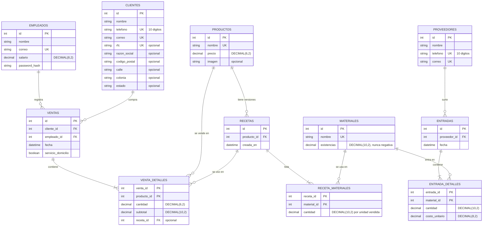

# Contrato Técnico — Tacos Tony Inventario Móvil

| Campo | Valor |
|---|---|
| Equipo / Autor(es) | Equipo 3 — Alexander Yamil Alcázar Muroaga, Fernando León Del Río, Emiliano André Castaños Mejía |
| Versión | 2.0 |
| Fecha | 2026-10-06 |
| Documento de origen | [01-vision-alcance_TacosTonyMovil_Leon.md](../Etapa%201/01-vision-alcance_TacosTonyMovil_Leon.md) (v2.0) |
| Estado | En revisión |

> **Propósito de este documento:** la Etapa 1 explicó *qué* problema resolvemos y *por qué*. Este contrato define *cómo se verificará* que la solución funciona y *qué decisiones técnicas* se tomaron. Es el documento que se le entrega a quien construye (persona o IA).
>
> **Regla de oro:** aquí no se repiten los requisitos de la Etapa 1; se referencian por su ID (RF-01, RNF-02...) y solo se agrega lo que falta para poder construir y probar.

---

## 1. Contexto y alcance del MVP

Tacos Tony Inventario Móvil es una aplicación web responsive, pensada primero para celular, con la que el gerente y los colaboradores de Tacos Tony Camino Real llevan el inventario de materiales desde el navegador de su teléfono: registran entradas de proveedores y ventas que descuentan materiales según la receta de cada producto, ven qué está bajo y consultan reportes. Resuelve que hoy las existencias solo se conocen revisando la bodega. El problema, los usuarios y los requisitos están en la [Etapa 1](../Etapa%201/01-vision-alcance_TacosTonyMovil_Leon.md).

**Alcance del MVP:** entran los 13 requisitos funcionales de la Etapa 1. No hay requisitos pospuestos; lo que no se construye está en la sección 6.

| ID | Requisito (título corto) | Prioridad | ¿Entra al MVP? |
|---|---|---|---|
| RF-01 | Sesión y roles por salario | Debe | Sí |
| RF-02 | Recuperar contraseña y editar perfil | Debería | Sí |
| RF-03 | Alta de materiales | Debe | Sí |
| RF-04 | Consulta de inventario | Debe | Sí |
| RF-05 | Productos y catálogo | Debe | Sí |
| RF-06 | Recetas por producto | Debe | Sí |
| RF-07 | Entradas de material | Debe | Sí |
| RF-08 | Registro de ventas | Debe | Sí |
| RF-09 | Descuento por receta y rechazo por faltante | Debe | Sí |
| RF-10 | Modificación de ventas | Debe | Sí |
| RF-11 | Pantalla de inicio (inventario bajo) | Debe | Sí |
| RF-12 | Clientes, proveedores y colaboradores | Debe | Sí |
| RF-13 | Reportes con descarga en PDF | Debería | Sí |

---

## 2. Decisiones de arquitectura

### ADR-01 — Un solo proyecto full-stack en Next.js + TypeScript

- **Contexto:** somos 3 personas y un semestre. Se necesita interfaz web para celular y una API que después use el complemento móvil (Etapa 6). Mantener dos proyectos (cliente y servidor) duplica configuración, despliegue y tipos de datos.
- **Opciones consideradas:** (A) SPA en React/Vite + API aparte en Express; (B) Next.js (App Router) con páginas y rutas `/api` en el mismo proyecto; (C) PHP con páginas renderizadas en servidor.
- **Decisión:** **B.** Next.js 16 con TypeScript, desplegado como un solo servicio Node.
- **Justificación:** las pantallas y la API comparten los mismos tipos y validaciones (Zod), hay un solo repositorio y un solo despliegue, y no se configura CORS. Frente a C, la lógica queda en una API JSON desde el inicio (ver ADR-02) en lugar de mezclada con el HTML.
- **Consecuencias:** se gana velocidad de desarrollo y consistencia de tipos. Se pierde la posibilidad de escalar cliente y servidor por separado, que no se necesita para una sucursal. Las imágenes de productos se guardan en un directorio persistente (`UPLOAD_DIR`) y se sirven por `GET /api/imagenes/[archivo]`, por lo que el hosting debe ofrecer disco persistente.

### ADR-02 — API-first: toda la lógica vive en `/api/*` y la interfaz es un cliente más (base de la Etapa 6)

- **Contexto:** la Etapa 6 pide un complemento móvil. Si las reglas (descuento por receta, validación de faltantes, roles) viven en las pantallas, habría que reescribirlas para la app.
- **Opciones consideradas:** (A) Server Actions y consultas a la base de datos directamente desde las páginas; (B) Route Handlers `/api/*` que devuelven JSON, y las páginas los consumen con `fetch`; (C) GraphQL.
- **Decisión:** **B.** Ninguna página ni componente accede a la base de datos; todo pasa por los endpoints de la sección 3.2.
- **Justificación:** el contrato de la sección 3.2 es exactamente lo que consumirá la app de la Etapa 6: mismas rutas, mismas entradas, mismas respuestas y mismos errores. La app solo construye pantallas. Cada regla de negocio se prueba una vez, contra la API, sin navegador.
- **Consecuencias:** se gana reutilización total del servidor en la Etapa 6 y pruebas de integración simples. Se pierde la comodidad de las Server Actions y la carga inicial hace una petición extra por pantalla; es aceptable porque las listas son pequeñas (decenas de filas).

### ADR-03 — MySQL 8 con Prisma, transacciones y recetas versionadas

- **Contexto:** una venta toca varias tablas a la vez (venta, renglones y existencias de varios materiales) y RNF-06 exige que se guarde completa o nada. RF-06 pide que la receta vigente sea la última asignada, y RF-10 necesita saber qué se descontó en una venta para poder devolverlo.
- **Opciones consideradas:** (A) MySQL 8 (InnoDB) con Prisma ORM; (B) MongoDB con recetas embebidas; (C) SQLite.
- **Decisión:** **A.** Cantidades y dinero en `DECIMAL`, nunca `FLOAT`. Toda operación que cambia existencias corre dentro de `prisma.$transaction`. Las recetas no se editan: cada asignación inserta una fila nueva en `recetas`, y cada renglón de venta guarda el `receta_id` que se usó.
- **Justificación:** los datos son relacionales (producto–receta–material, venta–producto) y la transacción ACID garantiza RNF-06. Guardar `receta_id` en el renglón permite devolver exactamente lo descontado aunque la receta haya cambiado después. `DECIMAL` evita errores de redondeo al multiplicar 0.10 kg × 3. MySQL es la base supuesta en la Etapa 1.
- **Consecuencias:** se gana integridad y migraciones versionadas (`prisma migrate`). Se pierde flexibilidad de esquema, y la tabla de recetas crece con cada reasignación (irrelevante al volumen de una sucursal).

### ADR-04 — Interfaz mobile-first con Tailwind CSS

- **Contexto:** el personal usa el sistema de pie, con una mano y en pantallas de 360 a 414 px (RNF-03, RNF-04). Varias pantallas son tablas (inventario, reportes) que no caben a ese ancho.
- **Opciones consideradas:** (A) diseñar para escritorio y ajustar con media queries; (B) diseñar desde 360 px con Tailwind CSS y ampliar con breakpoints `sm`/`lg`; (C) una librería de componentes (MUI, Bootstrap).
- **Decisión:** **B.** Navegación con barra inferior fija en celular y lateral desde `lg` (1024 px); en menos de 640 px las tablas se muestran como listas de tarjetas; controles táctiles de al menos 44 × 44 px; formularios en una sola columna.
- **Justificación:** empezar por 360 px obliga a que lo esencial quepa; ampliar es más fácil que recortar. Tailwind genera solo el CSS usado, lo que ayuda a RNF-02. Una librería de componentes agrega peso y estilos pensados para escritorio.
- **Consecuencias:** se gana una sola interfaz válida de 360 a 1280 px. Se pierde tiempo en construir componentes propios (botón, campo, tarjeta, barra de navegación).

### ADR-05 — Sesión con token firmado en cookie httpOnly y rol validado en el servidor

- **Contexto:** RNF-05 exige sesión de 30 minutos de inactividad y validación de rol en el servidor. El rol se deriva del salario (RF-01). La app de la Etapa 6 no maneja cookies igual que un navegador.
- **Opciones consideradas:** (A) sesiones guardadas en base de datos; (B) JWT guardado en `localStorage`; (C) JWT firmado (HS256) en cookie `httpOnly`, `SameSite=Lax`, con vigencia de 30 minutos renovada en cada petición autenticada.
- **Decisión:** **C.** Un único helper `requerirSesion(rol?)` se invoca al inicio de cada Route Handler. El mismo token se acepta en la cabecera `Authorization: Bearer` para la app de la Etapa 6. Contraseñas con `bcrypt` (costo 10).
- **Justificación:** la cookie `httpOnly` no es legible por JavaScript (a diferencia de `localStorage`), no requiere tabla de sesiones y la renovación en cada petición implementa la expiración por inactividad. El rol viaja firmado en el token y se comprueba en el servidor, nunca en la interfaz.
- **Consecuencias:** se gana simplicidad y compatibilidad con la Etapa 6. Se pierde la posibilidad de revocar una sesión antes de que expire (máximo 30 minutos), riesgo aceptado para el MVP.

---

## 3. Modelo de datos e interfaces

### 3.1 Modelo de datos



**Reglas del modelo**

1. **Rol:** no se guarda; se calcula como `salario > 7500 ? "GERENTE" : "COLABORADOR"` al iniciar sesión.
2. **Receta vigente** de un producto: la fila de `recetas` con mayor `id` para ese `producto_id`. Las recetas nunca se actualizan ni se borran.
3. **Subtotal:** `cantidad × precio` del producto en el momento de guardar el renglón; no cambia si después cambia el precio.
4. **`venta_detalles.receta_id`:** receta vigente al momento de la venta (o `NULL` si el producto no tenía receta). Es la que se usa para devolver materiales en RF-10.
5. **Un producto aparece una sola vez por venta** (llave primaria compuesta `venta_id + producto_id`).
6. **Inventario bajo:** `existencias <= 5`. El umbral es una constante del sistema, no un dato por material.
7. **Sin borrado:** ninguna tabla ofrece eliminación desde el sistema.

### 3.2 Contratos de interfaz

**Convenciones de la API**

- Entrada y salida en JSON (salvo la edición de producto, que es `multipart/form-data`). Fechas `AAAA-MM-DD`; cantidades y dinero como números con máximo 2 decimales.
- Todas las rutas, excepto `login` y `recuperar`, requieren sesión: sin sesión responden `401`. Las marcadas **G** requieren rol Gerente: con rol Colaborador responden `403`.
- Todo error tiene la forma `{ "error": { "codigo": "TEXTO_FIJO", "mensaje": "Texto en español para mostrar", "detalles": [] } }`.
- Códigos: `400` dato inválido o faltante, `401` sin sesión, `403` rol insuficiente, `404` no existe, `409` duplicado o existencias insuficientes, `413` archivo muy grande, `415` formato no permitido, `502` falló el envío de correo.

**Tabla de endpoints**

| Método y ruta | Rol | Descripción | Entrada | Salida exitosa | Errores |
|---|---|---|---|---|---|
| `POST /api/auth/login` | — | Inicia sesión | `{ correo, contrasena }` | `200 { empleado: { id, nombre, correo, rol }, token }` + cookie | `400`, `401 CREDENCIALES_INVALIDAS` |
| `POST /api/auth/logout` | Ambos | Cierra sesión | — | `204` y borra la cookie | `401` |
| `POST /api/auth/recuperar` | — | Envía contraseña temporal | `{ correo }` | `200 { enviado: true }` | `400 CORREO_INVALIDO`, `404 CORREO_NO_REGISTRADO`, `502 CORREO_NO_ENVIADO` |
| `GET /api/perfil` | Ambos | Datos del usuario en sesión | — | `200 { id, nombre, correo, rol }` | `401` |
| `PUT /api/perfil` | Ambos | Edita correo y/o contraseña | `{ correo, contrasena? }` | `200 { id, nombre, correo, rol }` | `400`, `409 CORREO_DUPLICADO` |
| `GET /api/materiales` | Ambos | Lista de materiales | — | `200 [ { id, nombre, existencias, bajo } ]` | `401` |
| `POST /api/materiales` | G | Alta de material | `{ nombre, existencias }` | `201 { id, nombre, existencias }` | `400`, `403`, `409 MATERIAL_DUPLICADO` |
| `GET /api/productos?pagina=N` | Ambos | Catálogo paginado (14 por página); sin `pagina` devuelve todos | — | `200 { items: [ { id, nombre, precio, imagen } ], total, pagina, por_pagina }` | `400` |
| `POST /api/productos` | G | Alta de producto | `{ nombre, precio }` | `201 { id, nombre, precio, imagen: null }` | `400`, `403`, `409 PRODUCTO_DUPLICADO` |
| `PUT /api/productos/:id` | G | Edita nombre, precio e imagen | multipart: `nombre`, `precio`, `imagen?` | `200 { id, nombre, precio, imagen }` | `400`, `403`, `404`, `409`, `413`, `415` |
| `GET /api/productos/:id/receta` | G | Receta vigente | — | `200 { receta_id, materiales: [ { material_id, nombre, cantidad } ] }` (lista vacía si no tiene) | `403`, `404` |
| `POST /api/productos/:id/receta` | G | Asigna nueva versión de receta | `{ materiales: [ { material_id, cantidad } ] }` | `201 { receta_id }` | `400`, `403`, `404` |
| `GET /api/clientes` | Ambos | Lista de clientes (para ventas) | — | `200 [ { id, nombre, ..., direccion_completa } ]` | `401` |
| `POST /api/clientes` | G | Alta de cliente | campos de `CLIENTES` | `201 { ...cliente }` | `400`, `403`, `409 TELEFONO_DUPLICADO / CORREO_DUPLICADO / RFC_DUPLICADO` |
| `PUT /api/clientes/:id` | G | Edita cliente | campos de `CLIENTES` | `200 { ...cliente }` | `400`, `403`, `404`, `409` |
| `GET /api/proveedores` | G | Lista de proveedores | — | `200 [ { id, nombre, telefono, correo } ]` | `403` |
| `POST /api/proveedores` | G | Alta de proveedor | `{ nombre, telefono, correo }` | `201 { ...proveedor }` | `400`, `403`, `409` |
| `POST /api/empleados` | G | Alta de colaborador | `{ nombre, correo, salario, contrasena }` | `201 { id, nombre, correo, rol }` | `400`, `403`, `409 CORREO_DUPLICADO` |
| `POST /api/entradas` | G | Registra entrada | ver detalle | `201 { id }` | `400`, `403`, `404` |
| `GET /api/ventas` | Ambos | Lista de ventas (para modificar), más reciente primero | — | `200 [ { id, fecha, cliente, empleado, servicio_domicilio, total } ]` | `401` |
| `GET /api/ventas/:id` | Ambos | Venta con renglones | — | `200 { id, ..., detalles: [ { producto_id, nombre, cantidad, subtotal } ] }` | `404` |
| `POST /api/ventas` | Ambos | Registra venta | ver detalle | `201 { id, total }` | `400`, `404`, `409 STOCK_INSUFICIENTE` |
| `PUT /api/ventas/:id/detalles` | Ambos | Modifica o agrega un renglón | ver detalle | `200 { id, total }` | `400`, `404`, `409` |
| `GET /api/dashboard` | Ambos | Datos de la pantalla de inicio | — | ver detalle | `401` |
| `GET /api/reportes/:tipo` | G | Uno de los 8 reportes | query según tipo | `200 { ... }` | `400`, `403`, `404 REPORTE_NO_EXISTE` |
| `GET /api/imagenes/:archivo` | Ambos | Imagen de producto | — | `200` (binario) | `404` |

**Detalle 1 — `POST /api/ventas` (RF-08, RF-09)**

```json
// Entrada
{ "cliente_id": 3, "fecha": "2026-10-06", "servicio_domicilio": false,
  "productos": [ { "producto_id": 1, "cantidad": 3 } ] }

// 201
{ "id": 90, "total": 135.00 }

// 409
{ "error": { "codigo": "STOCK_INSUFICIENTE",
  "mensaje": "No hay suficientes materiales para realizar la venta.",
  "detalles": [ { "material_id": 2, "nombre": "Carne árabe", "necesario": 0.30, "disponible": 0.20, "faltante": 0.10 } ] } }
```

- El `empleado_id` se toma de la sesión, nunca del cuerpo. A `fecha` se le agrega la hora actual del servidor (zona `America/Mexico_City`).
- `400` si: falta `cliente_id` o `fecha`, `productos` está vacío, una cantidad es `<= 0`, un producto se repite (`PRODUCTO_REPETIDO`), o `servicio_domicilio` es `true` y al cliente le falta código postal, calle, colonia o estado (`DIRECCION_INCOMPLETA`). `404` si el cliente o un producto no existe.
- Dentro de una transacción: se suma lo que necesita cada material entre **todos** los productos de la venta, se compara con las existencias y, si todo alcanza, se insertan venta y renglones y se descuentan existencias. Si algo no alcanza, no se guarda nada.

**Detalle 2 — `PUT /api/ventas/:id/detalles` (RF-10)**

```json
// Cambiar un renglón existente (mismo u otro producto)
{ "producto_id_anterior": 1, "producto_id": 1, "cantidad": 5 }
// Agregar un producto a la venta
{ "producto_id_anterior": null, "producto_id": 4, "cantidad": 2 }
```

- Devuelve al inventario `receta del renglón anterior (su receta_id) × cantidad anterior`; descuenta `receta vigente del nuevo producto × cantidad nueva`; recalcula `subtotal` con el precio actual. La validación de faltantes usa el neto (necesario − devuelto) por material.
- `400` cantidad `<= 0`; `404` venta, producto o renglón anterior inexistente; `409 PRODUCTO_REPETIDO` si el producto nuevo ya está en otro renglón de la venta; `409 STOCK_INSUFICIENTE` con el mismo formato del detalle 1. Ante cualquier error la venta y las existencias quedan como estaban.

**Detalle 3 — `POST /api/entradas` (RF-07)**

```json
// Entrada
{ "proveedor_id": 2, "fecha": "2026-10-06",
  "materiales": [ { "material_id": 2, "cantidad": 10, "costo_unitario": 180.00 } ] }
// 201
{ "id": 37 }
```

- `400` si falta proveedor o fecha, `materiales` está vacío, una cantidad es `<= 0`, un costo es `< 0` o un material se repite. `404` si el proveedor o un material no existe. Todo en una transacción.

**Detalle 4 — `POST /api/auth/login` (RF-01)**

- `400` si falta correo o contraseña. `401 CREDENCIALES_INVALIDAS` con el mismo mensaje ("Usuario o contraseña incorrectos") tanto si el correo no existe como si la contraseña no coincide.
- Éxito: cookie `tt_session` (`httpOnly`, `SameSite=Lax`, 30 min) y el mismo `token` en el cuerpo para clientes que no usan cookies (Etapa 6).

**Detalle 5 — `GET /api/dashboard` (RF-11)**

```json
{ "inventario_bajo": [ { "id": 2, "nombre": "Carne árabe", "existencias": 4.50 } ],
  "tiempo_guardado": [ { "id": 7, "nombre": "Desechables", "dias": 21 } ],
  "grafica": [ { "nombre": "Tortilla de harina", "existencias": 80.00 } ] }
```

- `inventario_bajo`: materiales con `existencias <= 5`, de menor a mayor. `tiempo_guardado`: días enteros desde la entrada más reciente de cada material que tenga al menos una entrada, de mayor a menor, máximo 15. `grafica`: los 15 materiales con más existencias, de mayor a menor.

**Detalle 6 — `GET /api/reportes/:tipo` (RF-13)**

Los importes de ventas se calculan con `venta_detalles.subtotal`.

| `tipo` | Parámetros | Contenido |
|---|---|---|
| `ingreso-producto` | `mes`, `anio` | Por producto vendido en el mes: ingresos y unidades, de mayor a menor ingreso; total general. |
| `corte-diario` | `fecha` | Total del día, número de ventas, base gravada (total ÷ 1.16), IVA (total − base), número e ingreso de servicios a domicilio, venta promedio por cliente (total ÷ clientes distintos) y ventas por empleado. |
| `ventas-mensual` | `mes`, `anio` | Los mismos indicadores del corte para todo el mes, más una fila por día (ventas, unidades, total). |
| `ganancia-producto` | — | Por producto con receta: precio, costo de producción (Σ cantidad de receta vigente × costo unitario de la última entrada de ese material), ganancia (precio − costo) y margen %. Solo productos con costo mayor a 0, de mayor a menor margen. |
| `rotacion` | `mes`, `anio` | Unidades vendidas por producto en el mes, de mayor a menor; total de unidades. |
| `ventas-semana` | `fecha_inicio` | Para los 7 días a partir de `fecha_inicio`: total vendido y unidades por día de la semana; total del rango. |
| `materiales-mas-usados` | `mes`, `anio` | Los 4 materiales que aparecen en la receta de más productos distintos vendidos en el mes. |
| `suministros` | `mes`, `anio` | Por entrada del mes: proveedor, fecha, cantidad total y costo total (Σ cantidad × costo unitario); total del mes. |

- `400 PERIODO_INVALIDO` si falta un parámetro o no es una fecha/mes válido. Un periodo sin datos responde `200` con listas vacías y totales en 0.
- La descarga en PDF se genera en el navegador a partir del reporte en pantalla; no hay endpoint de PDF.

**Pantallas**

| Ruta | Rol | Contenido |
|---|---|---|
| `/login` | — | Inicio de sesión y "¿Olvidaste tu contraseña?" |
| `/` | Ambos | Pantalla de inicio (RF-11) |
| `/inventario` | Ambos | Lista con búsqueda y orden (RF-04); el Gerente ve además "Alta" y "Asignar receta" |
| `/inventario/alta`, `/inventario/receta` | G | RF-03, RF-06 |
| `/movimientos` | Ambos | Accesos a Ventas y, para el Gerente, Entradas |
| `/movimientos/entradas` | G | Proveedor y fecha → materiales → confirmación (RF-07) |
| `/movimientos/ventas/nueva` | Ambos | Cliente y fecha → productos → confirmación (RF-08) |
| `/movimientos/ventas/modificar` | Ambos | Elegir venta → renglón → confirmación (RF-10) |
| `/catalogo` | Ambos | Catálogo paginado (RF-05) |
| `/administracion/*` | G | Clientes, proveedores, colaboradores, productos (RF-05, RF-12) |
| `/reportes`, `/reportes/[tipo]` | G | RF-13 |
| `/perfil` | Ambos | Editar perfil y cerrar sesión (RF-02) |

La navegación solo muestra las secciones permitidas para el rol; si un Colaborador abre a mano una ruta **G**, ve "No cuentas con los permisos necesarios para acceder a esta sección." y regresa a `/`.

---

## 4. Criterios de aceptación

Cada criterio se responde con "pasa" o "no pasa". Salvo que se indique otra cosa, las pantallas se prueban a **360 × 640 px**.

**Datos de prueba comunes:** productos "Taco árabe" ($45.00) y "Torta árabe" ($70.00). Receta vigente del Taco árabe: 0.10 de "Carne árabe" y 1 de "Pan árabe". Receta vigente de la Torta árabe: 0.15 de "Carne árabe" y 1 de "Telera". Ana es Gerente (salario 9,000.00) y Beto es Colaborador (salario 6,000.00).

### RF-01 — Sesión y roles por salario

**CA-01.1 (camino feliz)**
- **Given** Ana, con salario 9,000.00, en `/login`
- **When** escribe su correo y contraseña correctos y toca "Ingresar"
- **Then** llega a `/`, la navegación muestra Reportes y Administración, y `GET /api/perfil` devuelve `rol: "GERENTE"`

**CA-01.2 (error)**
- **Given** un correo registrado y una contraseña incorrecta
- **When** toca "Ingresar"
- **Then** la API responde `401 CREDENCIALES_INVALIDAS`, se muestra "Usuario o contraseña incorrectos", permanece en `/login` y al abrir `/inventario` es redirigido a `/login`

**CA-01.3 (caso límite: frontera del rol y bloqueo en servidor)**
- **Given** un empleado con salario exactamente 7,500.00 y sesión iniciada
- **When** envía `POST /api/materiales` con datos válidos y abre a mano `/reportes`
- **Then** la API responde `403` sin crear el material, y la pantalla muestra "No cuentas con los permisos necesarios para acceder a esta sección." y regresa a `/`; el mismo usuario sí puede abrir `/inventario` y registrar una venta

**CA-01.4 (cierre de sesión)**
- **Given** Beto con sesión iniciada
- **When** toca "Cerrar sesión" y después usa el botón "atrás" del navegador
- **Then** ve `/login` y `GET /api/materiales` responde `401`

### RF-02 — Recuperar contraseña y editar perfil

**CA-02.1 (camino feliz)**
- **Given** Beto en `/perfil`
- **When** cambia su contraseña a `nuevaClave9` y guarda, cierra sesión e inicia con la nueva contraseña
- **Then** ve "Cambios guardados" y el nuevo inicio de sesión funciona; con la contraseña anterior recibe `401`

**CA-02.2 (error)**
- **Given** la pantalla "¿Olvidaste tu contraseña?"
- **When** escribe `nadie@tacostony.mx`, que no está registrado
- **Then** la API responde `404 CORREO_NO_REGISTRADO`, se muestra "No se encontró una cuenta con ese correo" y no se envía ningún correo

**CA-02.3 (caso límite)**
- **Given** Beto en `/perfil`
- **When** intenta guardar una contraseña de 7 caracteres, y luego intenta cambiar su correo al de Ana
- **Then** la primera responde `400` con "La contraseña debe tener al menos 8 caracteres" y la segunda `409 CORREO_DUPLICADO`; en ambos casos sus datos no cambian

**CA-02.4 (recuperación correcta)**
- **Given** el correo registrado de Beto
- **When** solicita recuperar su contraseña
- **Then** recibe un correo con una contraseña de 8 caracteres alfanuméricos, puede iniciar sesión con ella y la contraseña anterior deja de funcionar; si el envío del correo falla (`502`), la contraseña anterior sigue funcionando

### RF-03 — Alta de materiales

**CA-03.1 (camino feliz)**
- **Given** Ana en `/inventario/alta` y ningún material llamado "Cebolla"
- **When** registra "Cebolla" con existencias 12.5
- **Then** la API responde `201` y "Cebolla" aparece en `/inventario` con existencias 12.50

**CA-03.2 (error)**
- **Given** que ya existe el material "Cebolla"
- **When** Ana intenta registrar "cebolla" (en minúsculas)
- **Then** la API responde `409 MATERIAL_DUPLICADO`, se muestra "Este material ya existe" y sigue habiendo un solo material con ese nombre

**CA-03.3 (caso límite)**
- **Given** Ana en `/inventario/alta`
- **When** registra "Cilantro" con existencias 0, y luego intenta registrar "Perejil" con existencias -1
- **Then** "Cilantro" se crea con 0.00 y aparece en el inventario bajo de `/`; "Perejil" responde `400` y no se crea

### RF-04 — Consulta de inventario

**CA-04.1 (camino feliz)**
- **Given** los materiales "Carne árabe" (12.50) y "Tortilla de harina" (80.00), y Beto en `/inventario`
- **When** escribe "car" buscando por nombre
- **Then** solo se muestran los materiales cuyo nombre contiene "car" (sin distinguir mayúsculas) con su ID y existencias; al ordenar por existencias quedan de menor a mayor

**CA-04.2 (error / sin resultados)**
- **Given** la misma pantalla
- **When** busca "mariscos", que no coincide con ningún material
- **Then** se muestra "Sin resultados" y al borrar el texto reaparecen todos los materiales

**CA-04.3 (caso límite)**
- **Given** un material con nombre de 45 caracteres y existencias 99999.99
- **When** se muestra en `/inventario` a 360 px
- **Then** el nombre se ajusta en varias líneas dentro de su tarjeta, las existencias completas son legibles y la página no tiene desplazamiento horizontal

### RF-05 — Productos y catálogo

**CA-05.1 (camino feliz)**
- **Given** Ana en Administración → Productos y ningún producto llamado "Agua de jamaica"
- **When** lo registra con precio 25, y después lo edita a precio 28 subiendo una imagen PNG de 300 KB
- **Then** el alta responde `201`, la edición `200`, y `/catalogo` muestra "Agua de jamaica", $28.00 y la imagen nueva

**CA-05.2 (error)**
- **Given** que existe el producto "Taco árabe"
- **When** Ana intenta dar de alta "taco árabe", o un producto con precio 0, o con precio 10000
- **Then** la primera responde `409 PRODUCTO_DUPLICADO` y las otras dos `400` con "Precio fuera del rango permitido"; no se crea ningún producto

**CA-05.3 (caso límite: imagen)**
- **Given** Ana editando un producto
- **When** sube un archivo `.pdf`, y luego una imagen JPG de 2.5 MB
- **Then** la API responde `415` y `413` respectivamente, y el producto conserva su imagen, nombre y precio anteriores

**CA-05.4 (caso límite: paginación)**
- **Given** 15 productos registrados y Beto en `/catalogo`
- **When** abre la página 1 y luego la página 2
- **Then** la página 1 muestra 14 productos y la página 2 muestra 1; Beto no ve ningún control para editar

### RF-06 — Recetas por producto

**CA-06.1 (camino feliz)**
- **Given** el producto "Agua de jamaica" sin receta y Ana en `/inventario/receta`
- **When** le asigna 0.05 de "Jamaica" y 0.03 de "Azúcar"
- **Then** la API responde `201` y `GET /api/productos/:id/receta` devuelve exactamente esos dos materiales con esas cantidades

**CA-06.2 (error)**
- **Given** Ana asignando una receta
- **When** envía la lista de materiales vacía, o un material con cantidad 0
- **Then** la API responde `400`, no se crea ninguna versión de receta y la vigente sigue siendo la anterior

**CA-06.3 (caso límite: versiones — interacción Catálogos → Movimientos)**
- **Given** "Carne árabe" con 5.00 y el Taco árabe con receta de 0.10 de carne, y una venta ya registrada de 1 Taco árabe (carne queda en 4.90)
- **When** Ana asigna una nueva receta con 0.12 de carne y se registra otra venta de 1 Taco árabe
- **Then** la carne queda en 4.78; la receta anterior sigue existiendo en la base de datos y la primera venta conserva su `receta_id` original

### RF-07 — Entradas de material

**CA-07.1 (camino feliz)**
- **Given** "Carne árabe" con 4.50 y "Pan árabe" con 20.00, y Ana en `/movimientos/entradas`
- **When** registra una entrada del proveedor "Carnes del Centro" con 10 de carne a $180.00 y 50 de pan a $4.00
- **Then** la API responde `201`, la carne queda en 14.50 y el pan en 70.00

**CA-07.2 (error)**
- **Given** Beto (Colaborador) con sesión iniciada
- **When** envía `POST /api/entradas` con datos válidos
- **Then** la API responde `403` y ninguna existencia cambia; además, la pantalla `/movimientos` de Beto no muestra el acceso a Entradas

**CA-07.3 (caso límite: atomicidad)**
- **Given** "Carne árabe" con 4.50 y "Pan árabe" con 20.00
- **When** Ana envía una entrada con 10 de carne y una segunda línea de pan con cantidad 0
- **Then** la API responde `400`, la carne sigue en 4.50, el pan en 20.00 y no se guarda ninguna entrada

**CA-07.4 (interacción Movimientos → Inicio)**
- **Given** "Carne árabe" con 4.50, visible en "Inventario bajo" de `/`, y cuya última entrada fue hace 12 días
- **When** Ana registra una entrada de 10 de carne con fecha de hoy
- **Then** al abrir `/`, "Carne árabe" ya no aparece en "Inventario bajo" y en "Tiempo guardado" muestra 0 días

### RF-08 — Registro de ventas

**CA-08.1 (camino feliz)**
- **Given** existencias suficientes y Beto en `/movimientos/ventas/nueva`
- **When** elige al cliente "Público general", la fecha de hoy, sin servicio a domicilio, agrega 3 Taco árabe y 1 Torta árabe y confirma
- **Then** la API responde `201` con `total: 205.00`; la venta queda con Beto como empleado, un renglón con subtotal 135.00 y otro con 70.00

**CA-08.2 (error)**
- **Given** la misma pantalla
- **When** intenta confirmar sin elegir cliente, o sin agregar productos, o con un producto en cantidad 0
- **Then** en cada caso la API responde `400`, se muestra un mensaje que indica el dato faltante y no se guarda ninguna venta

**CA-08.3 (caso límite: servicio a domicilio)**
- **Given** un cliente registrado sin colonia
- **When** Beto intenta registrarle una venta con servicio a domicilio
- **Then** la API responde `400 DIRECCION_INCOMPLETA`, se muestra "El cliente no cuenta con una dirección completa para el servicio a domicilio" y la misma venta sin servicio a domicilio sí se registra

**CA-08.4 (caso límite: empleado y producto repetido)**
- **Given** Beto con sesión iniciada
- **When** envía `POST /api/ventas` agregando `"empleado_id"` de Ana en el cuerpo, y otra petición con el Taco árabe dos veces en `productos`
- **Then** la primera venta queda registrada con Beto como empleado; la segunda responde `400 PRODUCTO_REPETIDO` y no se guarda

### RF-09 — Descuento por receta y rechazo por faltante (regla de negocio no trivial)

**CA-09.1 (camino feliz)**
- **Given** "Carne árabe" con 5.00 y "Pan árabe" con 40.00
- **When** se registra la venta de 3 Taco árabe
- **Then** la carne queda en 4.70 y el pan en 37.00

**CA-09.2 (error: faltante)**
- **Given** "Carne árabe" con 0.20 y "Pan árabe" con 40.00
- **When** se intenta registrar la venta de 3 Taco árabe
- **Then** la API responde `409 STOCK_INSUFICIENTE` con detalle de Carne árabe: necesario 0.30, disponible 0.20, faltante 0.10; no existe ninguna venta nueva, la carne sigue en 0.20 y el pan en 40.00

**CA-09.3 (caso límite: faltante acumulado entre productos)**
- **Given** "Carne árabe" con 0.40 y existencias suficientes de pan y telera
- **When** se intenta registrar una venta de 2 Taco árabe (0.20 de carne) y 2 Torta árabe (0.30 de carne)
- **Then** la API responde `409 STOCK_INSUFICIENTE` con necesario 0.50, disponible 0.40, faltante 0.10, aunque cada producto por separado sí alcanzaba; no se descuenta nada

**CA-09.4 (caso límite: existencias exactas — interacción Movimientos → Inicio)**
- **Given** "Carne árabe" con 0.30 y "Pan árabe" con 40.00
- **When** se registra la venta de 3 Taco árabe
- **Then** la venta se guarda, la carne queda en 0.00 (no negativa) y aparece en "Inventario bajo" de `/`

**CA-09.5 (caso límite: producto sin receta)**
- **Given** el producto "Agua embotellada" sin receta asignada
- **When** se registra la venta de 2 unidades
- **Then** la venta se guarda con su subtotal, su renglón queda con `receta_id` nulo y ninguna existencia cambia

### RF-10 — Modificación de ventas

**CA-10.1 (camino feliz: cambiar cantidad)**
- **Given** una venta con 3 Taco árabe, y después de ella "Carne árabe" con 4.70 y "Pan árabe" con 37.00
- **When** Beto modifica el renglón a 5 Taco árabe
- **Then** la carne queda en 4.50, el pan en 35.00 y el subtotal del renglón en 225.00

**CA-10.2 (error: faltante al aumentar)**
- **Given** la misma venta de 3 Taco árabe y "Carne árabe" con 0.10
- **When** Beto intenta modificar el renglón a 5 Taco árabe (necesita 0.20 adicionales)
- **Then** la API responde `409 STOCK_INSUFICIENTE` con faltante 0.10; el renglón sigue en 3, su subtotal en 135.00 y la carne en 0.10

**CA-10.3 (caso límite: reducir y cambiar de producto)**
- **Given** una venta con 3 Taco árabe, "Carne árabe" con 4.70, "Pan árabe" con 37.00 y "Telera" con 10.00
- **When** Beto cambia ese renglón por 1 Torta árabe
- **Then** la carne queda en 4.85 (+0.30 −0.15), el pan en 40.00, la telera en 9.00, y la venta tiene un solo renglón de Torta árabe con subtotal 70.00

**CA-10.4 (caso límite: la receta cambió después de la venta)**
- **Given** una venta de 3 Taco árabe hecha con la receta de 0.10 de carne, la carne en 4.70, y después una nueva receta vigente de 0.12
- **When** Beto modifica el renglón a 3 Taco árabe (misma cantidad)
- **Then** se devuelven 0.30 (receta original) y se descuentan 0.36 (receta vigente): la carne queda en 4.64 y el renglón apunta a la receta nueva

**CA-10.5 (caso límite: agregar producto)**
- **Given** una venta que ya tiene Taco árabe
- **When** Beto agrega 1 Torta árabe, y después intenta agregar otra vez Taco árabe como producto nuevo
- **Then** la primera responde `200`, descuenta 0.15 de carne y 1 telera y el total de la venta sube 70.00; la segunda responde `409 PRODUCTO_REPETIDO` sin cambiar nada

### RF-11 — Pantalla de inicio

**CA-11.1 (camino feliz)**
- **Given** "Carne árabe" con 4.50, "Salsa" con 2.00 y "Tortilla de harina" con 80.00
- **When** cualquier usuario abre `/`
- **Then** "Inventario bajo" lista Salsa (2.00) y después Carne árabe (4.50), no lista Tortilla de harina, y la gráfica incluye una barra para Tortilla de harina con valor 80

**CA-11.2 (error / estado vacío)**
- **Given** que todos los materiales tienen más de 5 y ninguno tiene entradas registradas
- **When** se abre `/`
- **Then** "Inventario bajo" muestra "Sin materiales con inventario bajo", "Tiempo guardado" muestra "Sin entradas registradas" y la página carga sin errores

**CA-11.3 (caso límite: umbral)**
- **Given** "Limón" con exactamente 5.00 y "Aguacate" con 5.01
- **When** se abre `/`
- **Then** Limón aparece en "Inventario bajo" y Aguacate no

**CA-11.4 (caso límite: más de 15 materiales)**
- **Given** 20 materiales registrados
- **When** se abre `/` a 360 px
- **Then** la gráfica muestra solo los 15 con más existencias, de mayor a menor, y cabe en pantalla sin desplazamiento horizontal

### RF-12 — Clientes, proveedores y colaboradores

**CA-12.1 (camino feliz)**
- **Given** Ana en Administración → Clientes
- **When** registra a "María López" con teléfono `2221234567` y correo `maria@correo.mx`, dejando vacíos RFC y dirección
- **Then** la API responde `201` y María aparece como opción al registrar una venta

**CA-12.2 (error: duplicados)**
- **Given** que existe un cliente con teléfono `2221234567`
- **When** Ana registra otro cliente con ese mismo teléfono, y un proveedor con un correo que ya tiene otro proveedor
- **Then** ambas responden `409` (`TELEFONO_DUPLICADO` y `CORREO_DUPLICADO`) con mensaje que indica el campo repetido, y no se crea ningún registro

**CA-12.3 (caso límite: teléfono y edición)**
- **Given** Ana registrando o editando un cliente
- **When** escribe un teléfono de 9 dígitos, o uno de 10 caracteres con una letra; y luego edita a María guardando su mismo teléfono y un correo nuevo
- **Then** las dos primeras responden `400` con "Número de teléfono no válido (debe tener 10 dígitos)"; la edición responde `200` (su propio teléfono no cuenta como duplicado)

**CA-12.4 (caso límite: alta de colaborador y rol)**
- **Given** Ana en Administración → Colaboradores
- **When** registra a "Carla" con salario 7,500.01 y a "Dani" con salario 7,500.00
- **Then** al iniciar sesión, Carla tiene rol Gerente y Dani rol Colaborador; en la base de datos sus contraseñas no están en texto plano

### RF-13 — Reportes con descarga en PDF

**CA-13.1 (camino feliz: corte diario)**
- **Given** que el 6 de octubre de 2026 hay exactamente dos ventas: una de $135.00 y otra de $70.00 con servicio a domicilio, a dos clientes distintos
- **When** Ana abre el reporte "Corte diario" para esa fecha
- **Then** muestra total $205.00, 2 ventas, base gravada $176.72, IVA $28.28, 1 servicio a domicilio por $70.00 y venta promedio por cliente $102.50

**CA-13.2 (error)**
- **Given** Beto (Colaborador) con sesión iniciada
- **When** pide `GET /api/reportes/corte-diario?fecha=2026-10-06`; y Ana pide `GET /api/reportes/corte-diario?fecha=2026-13-40`
- **Then** la primera responde `403` y la segunda `400 PERIODO_INVALIDO`

**CA-13.3 (caso límite: periodo sin datos)**
- **Given** un mes sin ventas ni entradas
- **When** Ana abre "Ingreso por producto" y "Suministros" de ese mes
- **Then** cada reporte muestra "Sin datos para el periodo" y total $0.00, sin errores

**CA-13.4 (interacción Movimientos → Reportes: ganancia)**
- **Given** el Taco árabe ($45.00) con receta de 0.10 de carne y 1 de pan, y como últimas entradas carne a $180.00 y pan a $4.00
- **When** Ana abre "Ganancia por producto"
- **Then** el Taco árabe muestra costo $22.00, ganancia $23.00 y margen 51.11 %; si después se registra una entrada de carne a $200.00, el costo pasa a $24.00

**CA-13.5 (descarga en PDF en celular)**
- **Given** Ana viendo cualquier reporte con datos a 360 px
- **When** toca "Descargar PDF"
- **Then** se descarga un archivo `.pdf` cuyo nombre incluye el reporte y el periodo, y que contiene los mismos totales que la pantalla

---

## 5. Requisitos no funcionales verificables

| ID | Categoría | Criterio medible | Cómo se verifica |
|---|---|---|---|
| RNF-01 | Rendimiento | `POST /api/ventas` responde en menos de 2.0 s en cada una de 20 ventas consecutivas de 3 productos, contra la base de datos de pruebas desplegada. | Script que envía las 20 ventas y registra el tiempo de cada respuesta; pasa si el máximo es menor a 2,000 ms. |
| RNF-02 | Rendimiento | `/inventario` con 50 materiales muestra la lista completa en menos de 3.0 s con el perfil "Slow 4G" y CPU ×4. | Chrome DevTools → Lighthouse (modo móvil): Largest Contentful Paint menor a 3.0 s en 3 corridas. |
| RNF-03 | Compatibilidad | En todas las rutas de la sección 3.2, `document.documentElement.scrollWidth <= window.innerWidth` a 360, 414, 768 y 1280 px. Sin errores de consola en las dos últimas versiones de Chrome (Android) y Safari (iOS). | Prueba automatizada con Playwright que recorre las rutas en los 4 anchos; revisión manual en un Android y un iPhone reales. |
| RNF-04 | Usabilidad | Todo botón, enlace de navegación y campo mide al menos 44 × 44 px. Registrar una venta de un producto se completa en máximo 3 pantallas a partir de `/movimientos` (cliente y fecha → productos → confirmación). | Medición con DevTools de los controles de cada pantalla; recorrido manual contando pantallas. |
| RNF-05 | Seguridad | (a) La columna `password_hash` contiene hashes bcrypt (prefijo `$2`). (b) Tras 30 minutos sin peticiones, la siguiente petición responde `401`. (c) El 100 % de los endpoints de la sección 3.2 responde `401` sin sesión y los marcados **G** responden `403` con sesión de Colaborador. | (a) Consulta directa a la base de datos. (b) Prueba con la vigencia del token reducida a 1 minuto por variable de entorno. (c) Prueba automatizada que recorre la tabla de endpoints con y sin sesión, y con cada rol. |
| RNF-06 | Integridad | (a) Si falla cualquier línea de una entrada, venta o modificación, no cambia ninguna fila de ninguna tabla. (b) Tras ejecutar todos los criterios de la sección 4, `SELECT COUNT(*) FROM materiales WHERE existencias < 0` devuelve 0. (c) Dos ventas simultáneas que juntas exceden las existencias: una se guarda y la otra responde `409`. | (a) CA-07.3, CA-09.2 y CA-10.2. (b) Consulta al final de la suite. (c) Prueba que lanza dos `POST /api/ventas` en paralelo con existencias para una sola. |

---

## 6. Fuera de alcance técnico

- No se implementará registro de mermas, ajustes manuales de existencias ni historial de movimientos por material.
- No se implementará stock mínimo configurable por material: el umbral de inventario bajo es la constante 5.
- No se implementarán pedidos de reabastecimiento, sugerencias de compra ni notificaciones (push, correo o SMS) de inventario bajo.
- No se implementará importación ni exportación en CSV o Excel; la única exportación es el PDF de reportes generado en el navegador.
- No se implementará eliminación de ningún registro, ni edición de materiales, proveedores, colaboradores, entradas o recetas ya guardadas. No se elimina una venta ni se quita un renglón de una venta.
- No se implementará facturación electrónica (CFDI), cobros ni pagos.
- No se implementará modo sin conexión, PWA instalable ni sincronización diferida: toda operación requiere conexión.
- No se construirá app nativa en este MVP; la Etapa 6 consumirá la API de la sección 3.2.
- No se soportarán varias sucursales ni roles adicionales a Gerente y Colaborador.
- No se usarán Server Actions ni acceso a la base de datos desde componentes (ADR-02).
- No se integrará con el punto de venta real de la sucursal.

---

## 7. Supuestos y preguntas abiertas

| # | Supuesto o pregunta | Responsable | Estado |
|---|---|---|---|
| 1 | El gerente validará las recetas (cantidades por producto) que se carguen como datos iniciales antes de las pruebas de la Etapa 3. | Fernando León | Abierta |
| 2 | Gerente y colaboradores tienen celular con Chrome o Safari actualizado e internet durante el turno (supuesto de la Etapa 1). | Equipo 3 | Abierta |
| 3 | Hosting: se necesita un servicio Node con disco persistente para imágenes y una instancia MySQL 8. ¿Railway, Render u otro? | Emiliano Castaños | Abierta |
| 4 | Cuenta SMTP para el correo de recuperación (RF-02). Las credenciales irán en variables de entorno, nunca en el repositorio. | Alexander Alcázar | Abierta |
| 5 | ¿El corte diario debe desglosar ingresos de alimentos y de bebidas? Requeriría agregar una categoría al producto, que hoy no está en RF-05; mientras no se confirme, no se incluye. | Equipo 3 / Gerente | Abierta |
| 6 | Los reportes usan el subtotal guardado en cada venta (precio del día de la venta), no el precio actual del producto. | Equipo 3 | Supuesto adoptado |
| 7 | El rol depende solo del salario (RF-01): subirle el salario a un colaborador por encima de $7,500 lo vuelve Gerente. Como no hay edición de colaboradores, en el MVP el rol queda fijo desde el alta. | Equipo 3 | Supuesto adoptado |

---

## 8. Contexto para el asistente de IA

*Bloque que se pega al inicio de cada sesión con el agente de IA.*

- **Proyecto:** Tacos Tony Inventario Móvil. Web responsive mobile-first para control de inventario de una taquería. Usuarios: Gerente y Colaborador. Todo el texto visible va en español de México.
- **Stack:** Next.js 16 (App Router) + TypeScript estricto; Tailwind CSS; MySQL 8 con Prisma; Zod para validar entradas; `jose` para el token de sesión; `bcryptjs` para contraseñas; `nodemailer` para el correo de recuperación; Vitest para pruebas de la API y Playwright para pruebas de pantallas. Node 22 LTS. Un solo proyecto, un solo despliegue.
- **Estructura del proyecto:**
  ```text
  /prisma
    schema.prisma          # modelo de la sección 3.1
    seed.ts                # datos de prueba de la sección 4
  /src
    /app
      /(auth)/login        # pantalla pública
      /(app)/...           # pantallas con sesión: inventario, movimientos, catalogo, administracion, reportes, perfil
      /api/...             # Route Handlers: un archivo route.ts por endpoint de la sección 3.2
    /components            # componentes de interfaz (Boton, Campo, Tarjeta, BarraNavegacion...)
    /lib
      db.ts                # cliente Prisma único
      sesion.ts            # crear/leer token, requerirSesion(rol?)
      errores.ts           # ErrorApi(codigo, mensaje, status, detalles) y respuesta uniforme
      validaciones.ts      # esquemas Zod compartidos por API y formularios
    /servicios             # reglas de negocio: ventas.ts, entradas.ts, recetas.ts, reportes.ts
  /tests                   # un archivo por RF; cada prueba lleva el ID de su criterio (CA-09.2)
  ```
- **Convenciones:**
  - Tablas y columnas en `snake_case` y en español, tal como aparecen en la sección 3.1; campos JSON de la API en `snake_case`.
  - Componentes en `PascalCase`; funciones y variables en `camelCase` y en español (`registrarVenta`, `calcularFaltantes`).
  - Los Route Handlers solo validan (Zod), llaman a `requerirSesion` y delegan en `/servicios`. Las reglas de negocio no se escriben en `route.ts` ni en componentes.
  - Dinero y cantidades con `Prisma.Decimal`; nunca `number` de punto flotante para sumar o multiplicar.
  - Errores siempre con el formato y los códigos de la sección 3.2.
  - Secretos (`DATABASE_URL`, `SESSION_SECRET`, `SMTP_*`, `UPLOAD_DIR`) solo en variables de entorno; se versiona `.env.example`, nunca `.env`.
- **Reglas de negocio que no se pueden romper:**
  1. Rol = Gerente si `salario > 7500`; en otro caso Colaborador. Se valida en el servidor en cada endpoint.
  2. Receta vigente = la de mayor `id` para el producto. Las recetas no se editan ni se borran; cada asignación inserta una nueva.
  3. Una venta se rechaza completa (`409 STOCK_INSUFICIENTE`) si falta cualquier material, sumando lo que necesitan todos sus productos. Las existencias nunca quedan negativas.
  4. Toda operación que cambia existencias corre en `prisma.$transaction` y bloquea las filas de materiales que toca.
  5. El `empleado_id` de una venta sale de la sesión, nunca del cuerpo de la petición.
  6. Inventario bajo = `existencias <= 5`.
- **Reglas para el agente:**
  - No agregar funcionalidades, endpoints, tablas ni columnas que no estén en las secciones 3 y 4. En particular, nada de lo listado en la sección 6.
  - No cambiar decisiones de la sección 2 sin proponerlo primero.
  - Toda funcionalidad nueva debe tener antes un criterio de aceptación en la sección 4.
  - Cada cambio se entrega con la prueba del criterio que cumple, nombrada con su ID.
  - Diseñar cada pantalla primero a 360 px; controles de al menos 44 × 44 px; sin desplazamiento horizontal.

---

## 9. Uso de IA en esta entrega

| Agente / modelo | Sección del contrato | Para qué se usó | Qué tuvimos que corregir manualmente |
|---|---|---|---|
| Gemini 3.8 Flash | Documento completo (versión 1.0) | Generar el primer borrador a partir de la plantilla y de la Etapa 1. | El borrador incluía funciones que no vamos a construir (mermas, stock mínimo por insumo, estado de "discrepancia", historial inmutable) y un stack de dos proyectos (React + Express) con el token guardado en `localStorage`. Decidimos descartar ese alcance y ese stack. |
| Claude Sonnet 5.5 | Secciones 3 y 4 (versión 1.0) | Revisar la consistencia del borrador. | Detectó endpoints que los criterios usaban y no estaban definidos, y supuestos marcados como confirmados sin estarlo; se corrigieron en la versión 1.0. |
| Claude Opus 5.5 | Documento completo (versión 2.0) | Reescribir el contrato sobre los requisitos de la Etapa 1 v2.0: ADR, modelo de datos, contratos de la API y criterios con valores numéricos. | Antes de redactar, la IA preguntó qué alcance mandaba y qué stack usar; el equipo definió que el alcance es solo lo acordado (sin funciones extra) y eligió Next.js + MySQL. Una versión intermedia generada con otro stack se descartó por decisión del equipo. Revisamos los valores de los criterios (existencias, totales, IVA) haciendo las cuentas a mano. |

**Reflexión breve:** la IA fue útil para estructurar el documento, proponer casos límite que no habíamos pensado (faltante acumulado entre dos productos de la misma venta, receta que cambia después de la venta) y mantener consistentes la tabla de endpoints y los criterios. Lo que hizo mal fue inflar el alcance: el primer borrador agregó funciones que sonaban razonables pero que nadie pidió, y eligió tecnología sin preguntar. La próxima vez empezaremos dándole la lista cerrada de funciones y el stack ya decidido, y le pediremos primero solo los criterios de la regla de negocio principal para revisarlos antes de generar el resto.

---

## 10. Lista de verificación antes de entregar

- [x] Todos los RF del MVP (RF-01 a RF-13) tienen al menos 3 criterios (feliz, error, límite).
- [x] Cada criterio se puede verificar con "pasa / no pasa".
- [x] No hay requisitos copiados de la Etapa 1; solo se referencian por ID.
- [x] Hay al menos 3 decisiones de arquitectura justificadas (son 5; ADR-02 explica el complemento móvil de la Etapa 6).
- [x] Al menos un criterio verifica la regla de negocio no trivial (CA-09.1 a CA-09.5).
- [x] Al menos 2 criterios verifican la interacción entre módulos (CA-06.3, CA-07.4, CA-09.4, CA-13.4).
- [x] Los RNF tienen una métrica y una forma de verificación.
- [x] La sección 6 (fuera de alcance) no está vacía.
- [x] El bloque para el asistente de IA (sección 8) está completo.
- [x] La sección 9 (uso de IA) indica agente, para qué se usó y qué se corrigió a mano.
- [ ] Cada integrante del equipo puede explicar y defender el documento completo.

---

## Historial de cambios

| Versión | Fecha | Cambio | Autor |
|---|---|---|---|
| 1.0 | 2026-10-05 | Versión inicial del contrato técnico. | Fernando León Del Río |
| 2.0 | 2026-10-06 | Se reescribió sobre la Etapa 1 v2.0: alcance de 13 RF, stack Next.js + MySQL, modelo de datos, contratos de la API y criterios de aceptación. | Equipo 3 |
